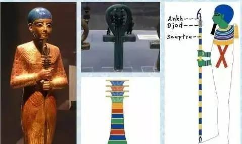

#  埃及神话—— Egypt Gods

*文章主要记录笔者学习埃及神话整个过程，研讨埃及神话和苏美尔神话以及世界各大神话中的联系，窥探人类之谜！*

接触**撒迦利亚·西琴(Zecharia Sitchin)** 先生穷其一生完成的巨著 **《地球编年史》**，书中大量考古发现，结合现代人类目前未解之谜，西琴先生给出了他的思考。笔者认为书中的考古证据是实实在在存在的，地球甚至宇宙已知仅仅万一，我们需要做的就是站在巨人肩膀了思考。书中提到苏美尔文明和埃及神话之间千丝万缕的联系，故对神秘的埃及文明进行了解，其中埃及神话可以反映出埃及古老文明的方方面面。

##### MINDING：
> 1. **传说可能都是真实发生过的事情！**
> 2. **别否定任何猜想，因为那可能是真相！**

一个文明的神话提现了这个文明之初原始人类对身边事物的描述，日月星辰，山川河流，同时也包含人类对自身从哪里来的思考，人类对这些由未知神秘巨大力量创造的各种逐渐的形成了自己一套认知体系，人类为这套体系赋予『人类』特点，形成了丰富的神话体系，着代表了人类最初的智慧与文明。

***各大文明最初认知体系都是以人的方式形成一套『神祗』神话体系，背后原因到底是以『人类』自身形体特点融入还是未知力量创造了熟悉的已知事物？？？***

## 埃及————尼罗河

在地球上，人类生命所需最珍贵的就是水资源，因此大江大河流域出现最早的人类文明，如两河流域的古巴比伦文明，黄河流域的古中国文明，而埃及就是在尼罗河的滋润下孕育了璀璨文明。

古埃及位于非洲东北部（今中东地区），它北临地中海，东濒红海，南邻努比亚（今埃塞俄比亚和苏丹）。纵贯埃及全境的尼罗河，由发源于非洲中部的白尼罗河和发源于苏丹的青尼罗河汇合而成。流经森林和草原地带的尼罗河，每年7月至11月定期泛滥，浸灌两岸干旱的土地；含有大量矿物质和腐植质的泥沙随流而下，在两岸逐渐沉积下来，成为肥沃的黑色土壤。古代埃及人因而称自己的国家为“**凯麦特**”（意为**黑土地**）。[1]

整个埃及根据地理位置可分为上、下埃及两大部分， 以孟斐斯分界。
距今约9000多年前，人们在尼罗河河谷定居，开始在岸边建立房屋和村落，进行农业畜牧业的生产活动。距今7500年前，下埃及的法尤姆地区出现了早期城市，并开始使用铜器，为文明的形成奠定了基础。埃及神话当中主要以太阳和尼罗河为中心，是埃及神话永恒主题，两个象征着生命之源，前者具有强大的生命形式，主要为统治者，体现为王权神受，重仪式，以庞大的祭祀团和伟大的宫殿建筑；后者尼罗河主要为民间信仰，是人民生产发展和农业文明的重要保障，代表人们对丰收，物产的期许。

## 埃及神话体系
埃及历史之初，埃及人崇拜他们国家的动物:鳄鱼，公牛，猫，狒狒，蛇，甲虫等等，而埃及神祗当中大多数也都是人身动物头像。自古以来，埃及人就认为许多东西都具有神性，不但分别给以神名，而且信仰他们。例如信仰动物形象的神祗（圣兽）就是个特征。有的神只是原封不动的动物形象，有的神只则是在人体上安放了一个动物的头，有的则是头上安置神之象征的神像，有的则全是人的模样，而手上拿着神的象征。神祗带有动物特性也不仅仅是埃及的特有，比如我们中国的大神伏羲和女娲都是人首蛇身的兄妹。埃及神话中的神祗更为特殊，比如他们身形高大，比正常普通人高，而且身体中流淌的不是血液，而是黄金液体。那么为什么神话中，特别是埃及神话中神祗都是兽首人身呢，这至今也没有定论。

在埃及的每个神明都有他的力量范围，每个不同的地方对不同的神会有相同的要求，而不同的地方对不同的神会有相同的要求，而不同的神也可能会有相同的功能，至于每个神明的性格，则比较难以掌握。 大致上，埃及的神明可分成三种型态：（一）动物型态 （二）人的型态 （三）抽象型态。

埃及神话依据地域不同又分为三个神学体系：赫利奥波利斯(**Heliopolis**)神学，赫尔莫波斯(**Hermopolis**)神学和孟斐斯(**Memphis**)神学。
这三个主要为三个城邦强盛时期形成的体系，在后来底比斯城邦兴盛之后，也形成了底比斯神学，不过底比斯神学主要是将前三个创世神话中诸神的所有神迹改为阿蒙的功绩，使底比斯的主神权力变大。而每个创世神话其实都大同小异，其中以赫里奥波里斯(**Heliopolis**)的创世神话最为有名。

#### 赫尔莫波利斯神学(*Hermopolis*)
在世界浑沌不明时, 从混沌中生出了由四对女／男性神（即八元神）组成，其男神形象皆为青蛙，而女神形象则为蛇： 纳乌奈特/努恩(原初之水), 考克特/库(代表黑暗), 赫海特/胡(代表永恒), 阿蒙内特/阿蒙(代表空虚), 后来八元神们的互动最终达不到平衡，于是产生出了出原初之丘与原初之卵，众神便将卵放在丘上，太阳神便从中诞生。 

#### 孟斐斯(*Memphis*)神学
孟菲斯（memphis）的工匠之神，也是世界的创造神-普塔。他是在世界还没发生之前就已经存在了，他创造世界的方式是经由他的思想和言语来创造的，他心里想的、嘴巴说的，世间的一切包括其它的神明都是由他所创造出来的。 

有的地方另外一套说法：创世神普塔命令努恩（或八元神）生出原初之莲奈芙蒂斯，进而从中生出太阳神。据说这些神（八元神）在原初之水中游泳，并此在此地产下了原初之卵，但也有另一种说法，认为这些卵是由巨鸭或巨鹅所生，此外在王位的传承上，则说是由原初之水生出莲花，由莲花中飞出可爱的孩子，并由他来创造世界；而这个孩子意味着早晨的太阳，夜晚时再与莲花合并。

*孟斐斯神学体系中的创世神 普塔 

------------------------------------------------------------------------------------------------------------------------
下面主要讲述赫利奥波利斯(**Heliopolis**)神学

------------------------------------------------------------------------------------------------------------------------
## 赫利奥波利斯(**Heliopolis**)神学
### 创世纪——九柱神 *[2]*
世界之初，是一篇茫茫大海，是黑暗的**混沌(Chaos)** 之水，称之为**努恩(Nun)** 。一天从水中升起一块小山丘(或小石头)，称之为**Ben-Ben**石，在山丘之上站立着**阿图姆(Atum)** ，这便是太阳神**拉(La)** ，也可叫做塔姆，他是第一位大神。拉神比生他的努神要强大，他是众神之父与主宰。没有人知道太阳神拉的真实姓名，只有他自己知道，据说太阳神拉的姓名包含一切，知道了姓名也就拥有了一切，包括拉神的力量。后来被他的后代神祗**伊西斯**设计谋获取到拉伸的姓名，其他人无从知晓。

拉神一阵咳嗽，从唾液当中诞生出了空气之神舒(Shu, 男)以及湿润之神雨神泰芙努特(Tefnut, 女)(这里有的也说拉神呼气产生了舒，咳嗽产生了泰芙努特，还有其他说法是从精液当中诞生出这两位神)。舒神与泰芙努特结合，先后生育出地神盖布(Geb, 男)和天空之神努特(Nut, 女)。舒神举起天空神努特，让她的身体像罩蓬一样，也就是人们看到的那样斗篷状的天空，盖布神则平躺着(古人都认为天圆地方，天空像斗篷一样，大地是平坦的)。地神盖布和天空之神努特结合先后生出了冥神欧西里斯(奥西里斯 Osiris, 男), 生命女神伊西斯(Isis, 女), 沙漠之神赛特(Seth, 男)和亡灵女神奈芙蒂斯(Nephthys, 女)四位大神。

*其他说法*
- 拉神在诞生出舒神和泰芙努特神后，在努恩这片混沌海水中和两个孩子走散了，着急的父亲拉神取下自己的眼睛，让眼睛在混沌海水众寻找舒神和泰芙努特神，所幸后来找到了，拉神喜极而泣，流下眼泪，掉下的泪珠变成了人类。
- 也有据说因地神盖布和天空之神努特恩爱，整天缠绵在一起，他们的父亲舒神看不下，所以才把天空之神高高举起，让他们分开。于是天空女神向智慧之神请教

## Reference
> 1. [尼罗河流域文明(*百度百科*)](https://baike.baidu.com/item/%E5%8F%A4%E5%9F%83%E5%8F%8A%E6%96%87%E6%98%8E/744297?fromtitle=%E5%B0%BC%E7%BD%97%E6%B2%B3%E6%B5%81%E5%9F%9F%E6%96%87%E6%98%8E&fromid=3246788)
> 2. [ancientegypt.co.uk](http://www.ancientegypt.co.uk/gods/story/main.html)

 

