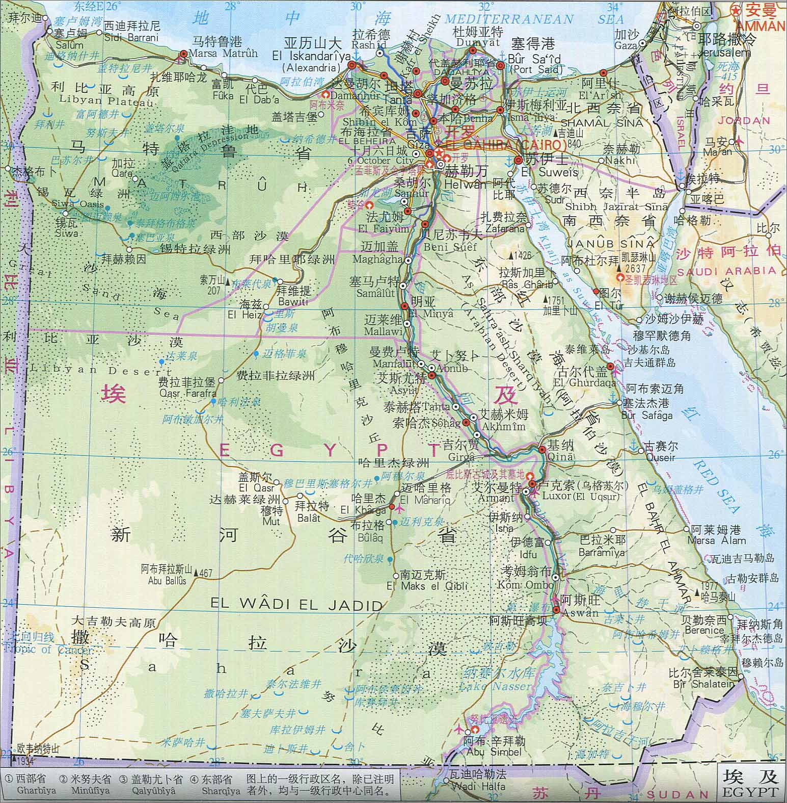
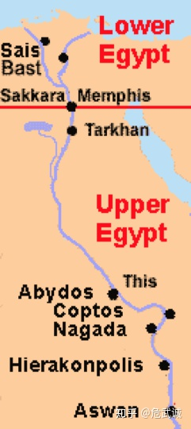

#  埃及神话—— Egypt Gods

*文章主要记录笔者学习埃及神话整个过程，研讨埃及神话和苏美尔神话以及世界各大神话中的联系，窥探人类之谜！*

接触**撒迦利亚·西琴(Zecharia Sitchin)** 先生穷其一生完成的巨著 **《地球编年史》**，书中大量考古发现，结合现代人类目前未解之谜，西琴先生给出了他的思考。笔者认为书中的考古证据是实实在在存在的，地球甚至宇宙已知仅仅万一，我们需要做的就是站在巨人肩膀了思考。书中提到苏美尔文明和埃及神话之间千丝万缕的联系，故对神秘的埃及文明进行了解，其中埃及神话可以反映出埃及古老文明的方方面面。

##### MINDING：
> 1. **传说可能都是真实发生过的事情！**
> 2. **别否定任何猜想，因为那可能是真相！**

一个文明的神话提现了这个文明之初原始人类对身边事物的描述，日月星辰，山川河流，同时也包含人类对自身从哪里来的思考，人类对这些由未知神秘巨大力量创造的各种逐渐的形成了自己一套认知体系，人类为这套体系赋予『人类』特点，形成了丰富的神话体系，着代表了人类最初的智慧与文明。

***各大文明最初认知体系都是以人的方式形成一套『神祗』神话体系，背后原因到底是以『人类』自身形体特点融入还是未知力量创造了熟悉的已知事物？？？***

## 埃及————尼罗河

在地球上，人类生命所需最珍贵的就是水资源，因此大江大河流域出现最早的人类文明，如两河流域的古巴比伦文明，黄河流域的古中国文明，而埃及就是在尼罗河的滋润下孕育了璀璨文明。

古埃及位于非洲东北部（今中东地区），它北临地中海，东濒红海，南邻努比亚（今埃塞俄比亚和苏丹）。纵贯埃及全境的尼罗河，由发源于非洲中部的白尼罗河和发源于苏丹的青尼罗河汇合而成。流经森林和草原地带的尼罗河，每年7月至11月定期泛滥，浸灌两岸干旱的土地；含有大量矿物质和腐植质的泥沙随流而下，在两岸逐渐沉积下来，成为肥沃的黑色土壤。古代埃及人因而称自己的国家为“**凯麦特**”（意为**黑土地**）。[1]

整个埃及根据地理位置可分为上、下埃及两大部分， 以孟斐斯分界。
距今约9000多年前，人们在尼罗河河谷定居，开始在岸边建立房屋和村落，进行农业畜牧业的生产活动。距今7500年前，下埃及的法尤姆地区出现了早期城市，并开始使用铜器，为文明的形成奠定了基础。

## 神话体系
### 原始之水

## Reference
> 1. [尼罗河流域文明(*百度百科*)](https://baike.baidu.com/item/%E5%8F%A4%E5%9F%83%E5%8F%8A%E6%96%87%E6%98%8E/744297?fromtitle=%E5%B0%BC%E7%BD%97%E6%B2%B3%E6%B5%81%E5%9F%9F%E6%96%87%E6%98%8E&fromid=3246788)
> 2. 

 

