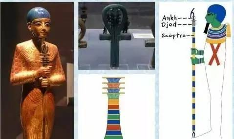

#  埃及神话—— Egypt Gods

*文章主要记录笔者学习埃及神话整个过程，研讨埃及神话和苏美尔神话以及世界各大神话中的联系，窥探人类之谜！*

接触**撒迦利亚·西琴(Zecharia Sitchin)** 先生穷其一生完成的巨著 **《地球编年史》**，书中大量考古发现，结合现代人类目前未解之谜，西琴先生给出了他的思考。笔者认为书中的考古证据是实实在在存在的，地球甚至宇宙已知仅仅万一，我们需要做的就是站在巨人肩膀了思考。书中提到苏美尔文明和埃及神话之间千丝万缕的联系，故对神秘的埃及文明进行了解，其中埃及神话可以反映出埃及古老文明的方方面面。

##### MINDING：
> 1. **传说可能都是真实发生过的事情！**
> 2. **别否定任何猜想，因为那可能是真相！**

一个文明的神话提现了这个文明之初原始人类对身边事物的描述，日月星辰，山川河流，同时也包含人类对自身从哪里来的思考，人类对这些由未知神秘巨大力量创造的各种逐渐的形成了自己一套认知体系，人类为这套体系赋予『人类』特点，形成了丰富的神话体系，着代表了人类最初的智慧与文明。

***各大文明最初认知体系都是以人的方式形成一套『神祗』神话体系，背后原因到底是以『人类』自身形体特点融入还是未知力量创造了熟悉的已知事物？？？***

## 埃及————尼罗河

在地球上，人类生命所需最珍贵的就是水资源，因此大江大河流域出现最早的人类文明，如两河流域的古巴比伦文明，黄河流域的古中国文明，而埃及就是在尼罗河的滋润下孕育了璀璨文明。

古埃及位于非洲东北部（今中东地区），它北临地中海，东濒红海，南邻努比亚（今埃塞俄比亚和苏丹）。纵贯埃及全境的尼罗河，由发源于非洲中部的白尼罗河和发源于苏丹的青尼罗河汇合而成。流经森林和草原地带的尼罗河，每年7月至11月定期泛滥，浸灌两岸干旱的土地；含有大量矿物质和腐植质的泥沙随流而下，在两岸逐渐沉积下来，成为肥沃的黑色土壤。古代埃及人因而称自己的国家为“**凯麦特**”（意为**黑土地**）。[1]

整个埃及根据地理位置可分为上、下埃及两大部分， 以孟斐斯分界。
距今约9000多年前，人们在尼罗河河谷定居，开始在岸边建立房屋和村落，进行农业畜牧业的生产活动。距今7500年前，下埃及的法尤姆地区出现了早期城市，并开始使用铜器，为文明的形成奠定了基础。埃及神话当中主要以太阳和尼罗河为中心，是埃及神话永恒主题，两个象征着生命之源，前者具有强大的生命形式，主要为统治者，体现为王权神受，重仪式，以庞大的祭祀团和伟大的宫殿建筑；后者尼罗河主要为民间信仰，是人民生产发展和农业文明的重要保障，代表人们对丰收，物产的期许。

## 埃及神话体系
埃及历史之初，埃及人崇拜他们国家的动物:鳄鱼，公牛，猫，狒狒，蛇，甲虫等等，而埃及神祗当中大多数也都是人身动物头像。自古以来，埃及人就认为许多东西都具有神性，不但分别给以神名，而且信仰他们。例如信仰动物形象的神祗（圣兽）就是个特征。有的神只是原封不动的动物形象，有的神只则是在人体上安放了一个动物的头，有的则是头上安置神之象征的神像，有的则全是人的模样，而手上拿着神的象征。神祗带有动物特性也不仅仅是埃及的特有，比如我们中国的大神伏羲和女娲都是人首蛇身的兄妹。埃及神话中的神祗更为特殊，比如他们身形高大，比正常普通人高，而且身体中流淌的不是血液，而是黄金液体。那么为什么神话中，特别是埃及神话中神祗都是兽首人身呢，这至今也没有定论。

在埃及的每个神明都有他的力量范围，每个不同的地方对不同的神会有相同的要求，而不同的地方对不同的神会有相同的要求，而不同的神也可能会有相同的功能，至于每个神明的性格，则比较难以掌握。 大致上，埃及的神明可分成三种型态：（一）动物型态 （二）人的型态 （三）抽象型态。

埃及神话依据地域不同又分为三个神学体系：赫利奥波利斯(**Heliopolis**)神学，赫尔莫波斯(**Hermopolis**)神学和孟斐斯(**Memphis**)神学。
这三个主要为三个城邦强盛时期形成的体系，在后来底比斯城邦兴盛之后，也形成了底比斯神学，不过底比斯神学主要是将前三个创世神话中诸神的所有神迹改为阿蒙的功绩，使底比斯的主神权力变大。而每个创世神话其实都大同小异，其中以赫里奥波里斯(**Heliopolis**)的创世神话最为有名。

#### 赫尔莫波利斯神学(*Hermopolis*)
在世界浑沌不明时, 从混沌中生出了由四对女／男性神（即八元神）组成，其男神形象皆为青蛙，而女神形象则为蛇： 纳乌奈特/努恩(原初之水), 考克特/库(代表黑暗), 赫海特/胡(代表永恒), 阿蒙内特/阿蒙(代表空虚), 后来八元神们的互动最终达不到平衡，于是产生出了出原初之丘与原初之卵，众神便将卵放在丘上，太阳神便从中诞生。 

#### 孟斐斯(*Memphis*)神学
孟菲斯（memphis）的工匠之神，也是世界的创造神-普塔。他是在世界还没发生之前就已经存在了，他创造世界的方式是经由他的思想和言语来创造的，他心里想的、嘴巴说的，世间的一切包括其它的神明都是由他所创造出来的。 

有的地方另外一套说法：创世神普塔命令努恩（或八元神）生出原初之莲奈芙蒂斯，进而从中生出太阳神。据说这些神（八元神）在原初之水中游泳，并此在此地产下了原初之卵，但也有另一种说法，认为这些卵是由巨鸭或巨鹅所生，此外在王位的传承上，则说是由原初之水生出莲花，由莲花中飞出可爱的孩子，并由他来创造世界；而这个孩子意味着早晨的太阳，夜晚时再与莲花合并。

**孟斐斯神学体系中的创世神 普塔** 

------------------------------------------------------------------------------------------------------------------------
下面主要讲述赫利奥波利斯(**Heliopolis**)神学

------------------------------------------------------------------------------------------------------------------------
## 赫利奥波利斯(**Heliopolis**)神学
### 创世纪——九柱神以及主神 *[2，3，4]*
世界之初，是一篇茫茫大海，是黑暗的**混沌(Chaos)** 之水，称之为**努恩(Nun)** 。一天从水中升起一块小山丘(或小石头)，称之为**Ben-Ben**石，在山丘之上站立着**阿图姆(Atum)** ，这便是太阳神**拉(La)** ，也可叫做塔姆，他是第一位大神。(埃及神话中阿图姆是第一神祗，众神之神，在埃及壁画中以普通男人，或者上下埃及双王冠形象出现，但是后来阿图姆和拉神形象合并了，变成了Ra-Atum或者Atum-Ra——一个鸟头人身的男性，头上顶着象征太阳的红色圆盘，还有一条眼镜蛇。)阿图姆是为黄昏(晚年统治时期)太阳神，拉是白昼时期的太阳神,都是指太阳神，在埃及古老壁画中以不同形象区分。

拉神比生他的努神要强大，他是众神之父与主宰。拉神代表太阳，他的名字在破晓时叫克佩拉，白昼时叫拉，傍晚时叫塔姆。没有人知道太阳神拉的真实姓名，只有他自己知道，据说太阳神拉的姓名包含一切，知道了姓名也就拥有了一切，包括拉神的力量。后来被他的后代神祗**伊西斯**设计谋获取到拉伸的姓名，其他人无从知晓。一天之内太阳神拉经过天空，晚间穿越冥间，第二天又花果天空，人们对一天24小时太阳的轨迹描述为拉神一天的行程。

拉神一阵咳嗽，从唾液当中诞生出了空气之神舒(Shu, 男)以及湿润之神雨神泰芙努特(Tefnut, 女)(这里有的也说拉神呼气产生了舒，咳嗽产生了泰芙努特，还有其他说法是从精液当中诞生出这两位神)。舒神与泰芙努特结合，先后生育出地神盖布(Geb, 男)和天空之神努特(Nut, 女)。舒神举起天空神努特，让她的身体像罩蓬一样，也就是人们看到的那样斗篷状的天空，盖布神则平躺着(古人都认为天圆地方，天空像斗篷一样，大地是平坦的)。地神盖布和天空之神努特结合先后生出了冥神欧西里斯(奥西里斯 Osiris, 男), 生命女神伊西斯(Isis, 女), 沙漠之神赛特(Seth, 男)和亡灵女神奈芙蒂斯(Nephthys, 女)四位大神。欧西里斯与伊西斯结为夫妇，而赛特则娶了奈芙蒂斯。

*其他说法*
- 拉神在诞生出舒神和泰芙努特神后，在努恩这片混沌海水中和两个孩子走散了，着急的父亲拉神取下自己的眼睛，让眼睛在混沌海水众寻找舒神和泰芙努特神，所幸后来找到了，拉神喜极而泣，流下眼泪，掉下的泪珠变成了人类。
- 也有据说因地神盖布和天空之神努特恩爱，在古埃及历法中，他们360天都整天缠绵在一起，做一些不可描述的事情，满天繁星就是他们的孩子。后来他们的父亲舒神看不下，所以才把天空之神高高举起，让他们分开。于是天空女神向智慧之神托特(Thoth)请教，在智慧之神的帮助下，他们去跟月亮之神玩游戏，用月亮的光来做赌注，月亮每输一局就得让出一些光给透特。最后游戏玩下来，透特积攒了很多光，他用这些光在360天之外，多造了5天出来。于是，历法就变成了一年有365天。他们获取了五天时间，在这五天时间里，他们生出了冥神欧西里斯(奥西里斯 Osiris, 男), 生命女神伊西斯(Isis, 女), 沙漠之神赛特(Seth, 男)和亡灵女神奈芙蒂斯(Nephthys, 女)四位大神。

*这里有一个问题，智慧之神托特)是从哪里冒出来的？按照神越靠后能力越弱的原则，智慧之神应该是大神，按照拉神之后的神祗顺序，托特感觉是突然冒出来的。根据苏美尔神话，埃及的太阳神拉就是马杜克，也就是恩基的儿子，大神安图的孙子，这样的话智慧之神托特和拉神等应该都是安图的子孙，而不是拉神(马杜克)的子孙，这样就可以解释了。* (预留一个坑,『苏美尔神话』是比埃及神话更古早的一个神话体系，也是西琴先生巨著《地球编年史》的主脉络)

- 努恩(Nun): 混沌之水，原初之水，茫茫一篇的海水*暗指大洪水(公园前14000年)*
- 阿图姆(Atum, 男): 普通的男人形象，有时候会戴着象征上下埃及的双王冠
- 太阳神——拉(Ra, 男): 一个鸟头人身的男性，头上顶着象征太阳的红色圆盘，还有一条眼镜蛇
- 空气之神——舒(Shu, 男): 特征是头上插着一根羽毛
- 湿润之神雨神——泰芙努特(Tefnut, 女): 形象特别好认——狮子脸、头上顶着太阳轮盘与眼镜蛇
- 大地之神——盖布(Geb, 男): 头上有一只鹅,有时候也被描绘成鹅头人身
- 天空之神——努特(Nut, 女): 通常被画成是有蓝色皮肤，四肢撑在地面的女人，有时身体上绘有星星（就像欧盟旗帜一样），努特同时是死亡女神，大多数石棺的内壁都绘有她的形象，传说法老死后会进入她的身体，不久便会重生
- 冥神——欧西里斯(奥西里斯 Osiris, 男): 冥王和农业之神。头带Atef crown (类似上埃及的白冠，两边加上羽毛)，手持曲柄权杖和连枷，身体被白布包起来。如果他的脸被画成绿色，则表示在复活中或已经复活
- 生命女神——伊西斯(Isis, 女): 生命、魔法、婚姻和生育女神。被敬奉为理想的母亲和妻子、自然和魔法的守护神。也被称作亡灵和幼童的保护神。头上顶着王座，手上拿着象征生命的安克。到了古王国时期，伊西斯的形象与荷鲁斯的妻子哈索尔(Hathor)合并。这时的伊西斯头戴“牛角+太阳圆盘+眼镜蛇”（全套标配的话，太阳圆盘上还有王座）
- 沙漠之神——赛特(Seth, 男): 沙漠、风暴之神，同时也是黑暗、混乱之神，象征风不调雨不顺的季节，赛特的耳朵是方的(阿努比斯的耳朵是尖的)
- 亡灵女神奈芙蒂斯(Nephthys, 女): 赛特的妻子，房屋和死者的守护神。她头顶着一只篮子或是一座小房屋，生有双翅。她通常出现在陪葬品中，或在棺材的两端与姐姐伊西斯一起现身，展开巨大的翅膀保护死者

**以上九神就是埃及神话著名的「九柱神」**

欧西里斯有一次喝醉酒，把赛特的妻子-奈芙蒂斯当成伊西斯，生下死神阿努比斯(Anubis)。以前欧西里斯统治人类，后被弟弟赛特杀害，经过伊西斯魔法复活，成为冥神，与伊西斯夫妻生了复仇之神荷鲁斯(Horus),这个过程来自于欧西里斯神话故事，后来荷鲁斯打败叔叔赛特，夺回王位，为父亲复仇成功，成为人类之主。荷鲁斯之眼又称真知之眼，相传为从古埃及时代流传至今，也是古埃及文化中最令人印象深刻的符号之一。荷鲁斯的右眼象征太阳，有远离痛苦、战胜邪恶的力量，左眼象征月亮，具有复活死者的力量。这可能是全球最知名的神秘符号。

除此之外，据说拉的眼睛诞生了爱神哈托尔(Hathor)，为荷鲁斯的乳母以及妻子，与荷鲁斯生下四个儿子，冥王身体肝脏胃肠的守护者，通常为木乃伊旁边的罐子形象出现。

上面提到智慧之神托特(Thoth)来历未明(*笔者也没查到*), 智慧之神，同时也是月亮、数学、医药之神，埃及象形文字的发明者，众神的文书，也是赫里奥波里斯的主神之一。在《亡灵书》中被描绘为立姿审判者。以佩戴满月圆盘及新月冠鹮头人身，或狒狒形象出现。他曾教导年幼的荷鲁斯，协助他击败赛特夺回王位,《亡灵书》(《死亡之书》, 《book of death》)就是他完成的。他和妻子玛特(Maat)一共生有十个孩子。

- 智慧之神——托特(Thoth, 男): 智慧之神，外形为鹭鸶
- 真理与正义女神——玛特(Maat, 女): 托特之妻
- 死神——阿努比斯(Anubis, 男): 护送灵魂通向另一个世界，外形为胡狼首人身，耳朵是尖的。每个古埃及人死后，亡灵都要在冥王奥西里斯面前自述清白，然后心脏交由阿努比斯放在天平上称量。天平一端是死者的心脏，另一端是名为“玛特”的真理之羽
- 复仇之神——荷鲁斯(Horus, 男): 法老的守护者，外形为鹰。隼头人身的荷鲁斯可能是出镜率最高的古埃及神祗，它是法老的守护神，是王权的象征。他头上戴着的双王冠就是证明：白冠代表上埃及，红冠代表下埃及。上下埃及统一后，王冠就变成了荷鲁斯头上的样子
- 爱神——哈托尔(Hathor/Het-Heru，Het-Hert, 女): 荷鲁斯之妻，司爱情及美丽, 传为拉的眼睛。埃及的丰饶女神，是古埃及所有女神中最美的，外形幻化成牡牛。在奥西里斯神话中，她是荷鲁斯的养母和妻子。基本上每一头头上有太阳圆盘的牛就是她的化身
- 荷鲁斯与哈托尔的四个儿子
  * 艾姆谢特（Amset, Mesta）：荷鲁斯四子之一，死者肝脏的保护者, 人头。罐子放在南方
  * 哈碧（Hapi，Golden Dawn，Ahephi）：荷鲁斯四子之一，死者肺的保护者, 长着狒狒或猕猴头。罐子放在北方
  * 多姆泰夫（Duamutef，Tuamutef;Golden Dawn，Thmoomathph）：荷鲁斯四子之一，死者胃的保护者, 长着胡狼头或猎犬头。罐子放在东方
  * 凯布山纳夫（Qebhsenuef）：荷鲁斯四子之一，死者肠的保护者, 长着秃鹫头或鹰隼头。罐子放在西方

这时候可以认识埃及壁画中大多数神祗了。

##### [ 下一篇--拉神的故事](Egypt_Gods_2-ra.md)

## Reference
> 1. [尼罗河流域文明(*百度百科*)](https://baike.baidu.com/item/%E5%8F%A4%E5%9F%83%E5%8F%8A%E6%96%87%E6%98%8E/744297?fromtitle=%E5%B0%BC%E7%BD%97%E6%B2%B3%E6%B5%81%E5%9F%9F%E6%96%87%E6%98%8E&fromid=3246788)
> 2. [ancientegypt.co.uk](http://www.ancientegypt.co.uk/gods/story/main.html)
> 3. [埃及神话故事](http://www.shenhuagushi.net/aijishenhua/list_52.html)
> 4. [维基百科-Egyptian_mythology](https://en.wikipedia.org/wiki/Egyptian_mythology)
 

