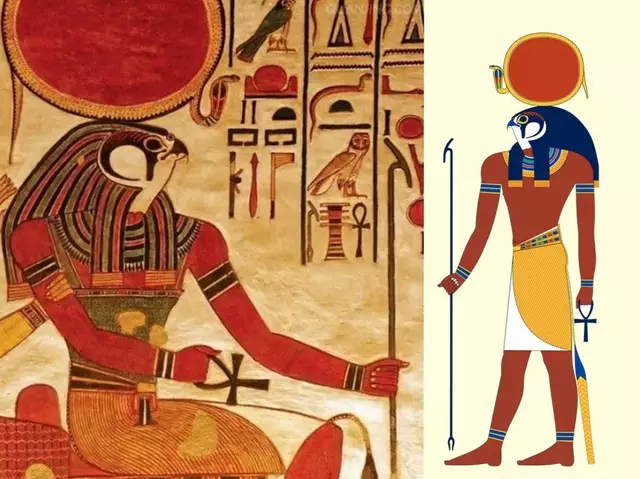

#  埃及神话—— Egypt Gods

## 赫利奥波利斯(**Heliopolis**)神学
### [创世纪——九柱神以及主神](Egypt_Gods_1-genesis.md)
###  拉神
### [欧西里斯、伊西斯、荷鲁斯的故事](Egypt_Gods_3-osiris.md)
### [其他神以及故事](Egypt_Gods_4-othergods.md)

#### 拉神的诞生
埃及神话中拉神的诞生是这样描述的：
**从前有一片混沌之海，后来冒出一个小山丘，拉神就站在小山丘上**

大家可能都听说过，在世界各个文明中都有着对史前大洪水的记载，美索不达米亚、希腊、印度、中国、玛雅等文明中，都有洪水灭世的传说，如最早的《吉尔伽美什史诗》;而更知名的就属《圣经》当中的记载了，据《圣经 创世纪》记载：上帝降洪水灭世前，命令诺亚造方舟，让他携带全家和地上保留的各种动物一起避难，因而得救。40天后，洪水退落，诺亚放出一只乌鸦去打探地面洪水是否褪去。可是这只乌鸦却一去不复返。诺亚后来又放出鸽子。不久，鸽子衔一截橄榄枝飞回。诺亚于是知道地上洪水已经退去，已经平安无事。后来人们就把鸽子和橄榄枝当作和平的象征。而且据现代科学家考证，各个文明所描述的『大洪水』可能真实的在地球发生过。

2010年，中国香港和土耳其探险队发布一则消息，在土耳其亚拉拉特山附近，海拔约4000米高的地方，他们找到了一艘巨大的木船残骸。科学检测这些残骸，学者得出结论：木船残骸距今4800余年，即《创世纪》中所描述的诺亚方舟的存在时期；而且，木船结构、规模等与文献中的诺亚方舟高度相似。“虽然我们不能百分之百确定它就是诺亚方舟，但可能性达到99.9%。”荷兰著名方舟探索家格力特·艾顿认为，很多细节与史载高度吻合，已有大量的证据表明，这个木结构就是圣经中记载的诺亚方舟遗迹。

在这里我们可以发现一件非常有意思的事情，我们相信地球确实发生过史前大洪水，那么埃及神话中的混沌之海不就描述的是大洪水，地球成了大海吗？后来冒出了一个小山丘，这不就描述的是大洪水褪去，山峰露出水面的场景吗？《圣经》中记载大洪水持续了一年，诺亚派出去一只鸽子勘察，后来鸽子衔回橄榄枝，这才预示着洪水褪去，让我们看看埃及神话中太阳神拉的形象，鹰头人身，是否和鸽子很像？都是尖嘴圆。头有人会有疑问，鸽子和鹰不像啊，但是反问你一句，如果大洪水和诺亚的故事真实存在，假如你是诺亚，你会派出一只鸽子还是老鹰去巡查？如果是我，我会派老鹰，飞得更高，看的更远，更好的勘察，所以在这里，我们要结合埃及神话和《圣经》来思考。

在创世时，赖神开言，命令地和天从那片茫茫大海中升起来。地和天就在赖神的光辉照耀下升起来了，风神舒把苍穹之神努特举起来，放在天上。女神努特造成了苍穹，笼罩着地神塞勃。塞勃躺在努特下面，而努特在东边地平线处踮着脚尖站着，在西边地平线处弯下身去，伸出手臂，用手指尖支持着身体。在黑暗中，可以看见星星在她身体上闪耀，也在她的伟大的、不知疲倦的四肢上闪耀。赖神只要随心所欲地说出他心中的愿望来，他所提名的东西立刻成形。他向太空中凝视时，他所想要看到的东西就出现在他眼前了。他创造了所有生存在水里和陆地上的生物。人类是从她的眼睛里生出来的；造物主赖神本来是众神之主，现在也成了地球上的第一个国王。他变成人形，在人们中间走来走去。对于他，一世纪就像一年一样。

在古埃及神话中，拉神不仅是造物之主，众神之主，他还教人类创造发 明，为人类祛灾免邪，降福于人，困而他深得人类的爱待和颂扬，以至古埃 及的法老们也纷纷以拉神自居。在古埃及早期，埃及法老宣城是拉神的后代，后来拉神老去，到欧西里斯统治埃及，埃及法老尊欧西里斯为最高神祗，后来欧西里斯去当了冥神，荷鲁斯又成了埃及人心中的神。古埃及神话中的神也会老去，甚至会死去，但是神会通过某种方法复活，比如欧西里斯。我们也知道太阳神拉有很多名字，破晓时叫克佩拉，白昼时叫拉，傍晚时叫塔姆，这种表面描述太阳运行规律的说法，实际也揭示了拉神不同时期，人们心中对拉神的看法，傍晚的太阳就代表晚年的拉神。

拉神有许多名字，但是没人知道真实名称，据说拉神的真实名字包含了神奇力量，任何人知道了拉神的名字，也就获取了拉神的力量。女神伊西丝变成了女人住在人间，过人类的生活过腻了，想回到天神中去。她是一个会魔法的人，她很想在天上和地上具有和赖神一样大的权力。因此她私下渴望着知道这位天父的秘密名字，这个秘密名字一直隐藏在他心中，他从来没有告诉过别人。

##### [ 上一篇--创世纪——九柱神以及主神](Egypt_Gods_1-genesis.md)
##### [ 下一篇--其他神以及故事](Egypt_Gods_3-osiris.md)

## Reference
> 1. [尼罗河流域文明(*百度百科*)](https://baike.baidu.com/item/%E5%8F%A4%E5%9F%83%E5%8F%8A%E6%96%87%E6%98%8E/744297?fromtitle=%E5%B0%BC%E7%BD%97%E6%B2%B3%E6%B5%81%E5%9F%9F%E6%96%87%E6%98%8E&fromid=3246788)
> 2. [ancientegypt.co.uk](http://www.ancientegypt.co.uk/gods/story/main.html)
> 3. [埃及神话故事](http://www.shenhuagushi.net/aijishenhua/list_52.html)
> 4. [维基百科-Egyptian_mythology](https://en.wikipedia.org/wiki/Egyptian_mythology)
