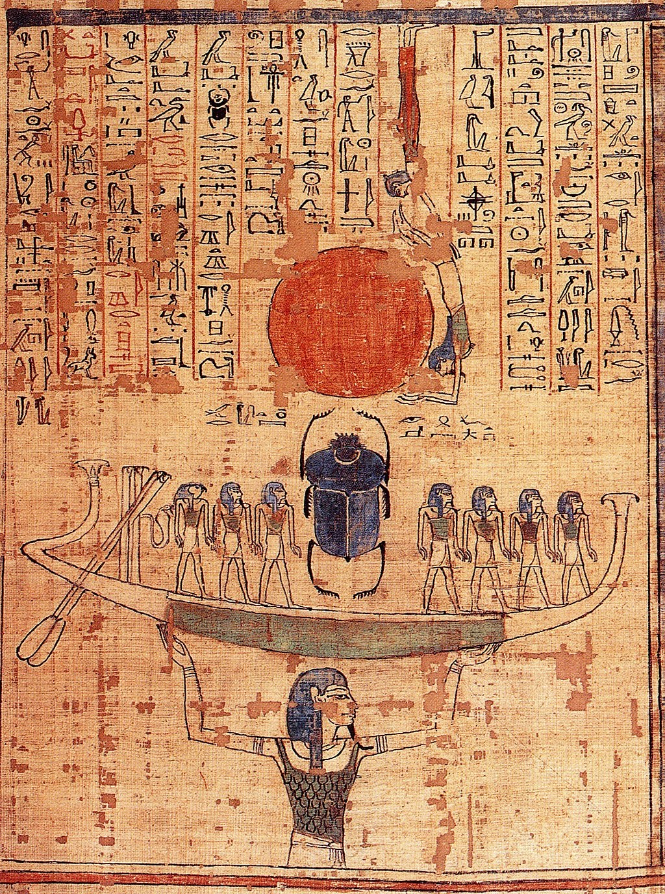
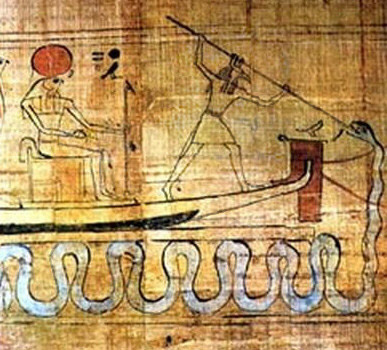
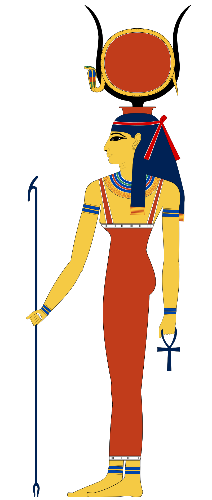

#  埃及神话—— Egypt Gods

## 赫利奥波利斯(**Heliopolis**)神学
### [创世纪——九柱神以及主神](Egypt_Gods_1-genesis.md)
###  拉神
### [欧西里斯、伊西斯、荷鲁斯的故事](Egypt_Gods_3-osiris.md)
### [其他神以及故事](Egypt_Gods_4-othergods.md)

#### 拉神的诞生
埃及神话中拉神的诞生是这样描述的：
**从前有一片混沌之海，后来冒出一个小山丘，拉神就站在小山丘上**

大家可能都听说过，在世界各个文明中都有着对史前大洪水的记载，美索不达米亚、希腊、印度、中国、玛雅等文明中，都有洪水灭世的传说，如最早的《吉尔伽美什史诗》;而更知名的就属《圣经》当中的记载了，据《圣经 创世纪》记载：上帝降洪水灭世前，命令诺亚造方舟，让他携带全家和地上保留的各种动物一起避难，因而得救。40天后，洪水退落，诺亚放出一只乌鸦去打探地面洪水是否褪去。可是这只乌鸦却一去不复返。诺亚后来又放出鸽子。不久，鸽子衔一截橄榄枝飞回。诺亚于是知道地上洪水已经退去，已经平安无事。后来人们就把鸽子和橄榄枝当作和平的象征。而且据现代科学家考证，各个文明所描述的『大洪水』可能真实的在地球发生过。

2010年，中国香港和土耳其探险队发布一则消息，在土耳其亚拉拉特山附近，海拔约4000米高的地方，他们找到了一艘巨大的木船残骸。科学检测这些残骸，学者得出结论：木船残骸距今4800余年，即《创世纪》中所描述的诺亚方舟的存在时期；而且，木船结构、规模等与文献中的诺亚方舟高度相似。“虽然我们不能百分之百确定它就是诺亚方舟，但可能性达到99.9%。”荷兰著名方舟探索家格力特·艾顿认为，很多细节与史载高度吻合，已有大量的证据表明，这个木结构就是圣经中记载的诺亚方舟遗迹。

在这里我们可以发现一件非常有意思的事情，我们相信地球确实发生过史前大洪水，那么埃及神话中的混沌之海不就描述的是大洪水，地球成了大海吗？后来冒出了一个小山丘，这不就描述的是大洪水褪去，山峰露出水面的场景吗？《圣经》中记载大洪水持续了一年，诺亚派出去一只鸽子勘察，后来鸽子衔回橄榄枝，这才预示着洪水褪去，让我们看看埃及神话中太阳神拉的形象，鹰头人身，是否和鸽子很像？都是尖嘴圆。头有人会有疑问，鸽子和鹰不像啊，但是反问你一句，如果大洪水和诺亚的故事真实存在，假如你是诺亚，你会派出一只鸽子还是老鹰去巡查？如果是我，我会派老鹰，飞得更高，看的更远，更好的勘察，所以在这里，我们要结合埃及神话和《圣经》来思考。

在创世时， 拉神开言，命令地和天从那片茫茫大海中升起来。地和天就在 拉神的光辉照耀下升起来了，风神舒把苍穹之神努特举起来，放在天上。女神努特造成了苍穹，笼罩着地神塞勃。塞勃躺在努特下面，而努特在东边地平线处踮着脚尖站着，在西边地平线处弯下身去，伸出手臂，用手指尖支持着身体。在黑暗中，可以看见星星在她身体上闪耀，也在她的伟大的、不知疲倦的四肢上闪耀。 拉神只要随心所欲地说出他心中的愿望来，他所提名的东西立刻成形。他向太空中凝视时，他所想要看到的东西就出现在他眼前了。他创造了所有生存在水里和陆地上的生物。人类是从她的眼睛里生出来的；造物主 拉神本来是众神之主，现在也成了地球上的第一个国王。他变成人形，在人们中间走来走去。对于他，一世纪就像一年一样。

据传说，拉神在白天和夜晚分别乘坐“曼杰特”（Mandjet-万年之船）和“麦塞克泰特”（Mesektet）的二艘太阳船航行。这些船载着他穿行在天空和“杜阿特”(Duat)-埃及文学中的地府。坐在“麦塞克泰特”船上的拉神呈现公羊神的形象。当他出行时总伴有其他各种神，包括西亚（洞察）和胡（发布命令）以及赫卡（魔力）。有时一些九元神也在他的旅途中帮助他，如塞特助他降伏了巨蛇阿波普(Apep)；迈罕帮他对抗阴间的怪物。混沌神阿波菲斯（Apophis)(阿波普)是一条巨蛇，总是想通过干扰或用凝视催眠的方式来阻制太阳船每晚的出行。在晚间，埃及人相信拉神是以阿图姆或公羊神的形象出现。“麦塞克泰特船”带着他穿过冥界返回到东方以再次重生。拉神的这些神话将太阳的升起象征为天空女神努特重生太阳。

埃及人把尼罗河视为他们 的生命之源，所以他们认为世界是由水而生。拉神每天要坐太阳船（即拉神 之船）出外巡游。当东方太阳升起时，拉神坐太阳船去尼罗河巡视，给人类带来幸福、安祥；每到夜晚，太阳船便从西而下，进入冥河，开始在黑暗世 界里度过。在埃及人看来，世界只有两条河流，一条是埃及河，即尼罗河，它既代表白昼，又象征着光明世界；另一条是天河，即冥河，它代表黑夜，又象征着地狱世界，冥府之国。拉神在冥河里要经过十二道城门，即十二个钟点，每道门都预示着艰险和阻碍，于是拉神的太阳船暗渡冥河的故事就成 为战胜妖魔，克服困难，迎接黎明的优美传说。首先迎接拉神太阳船的是拉神之河的王国，这里有六条巨大的蟒蛇守候，不时地向来者侵袭。太阳船头是苍天女神和风神护卫，很快他们便安全 度过第一个钟点。在冥河里，每走一个钟点，都要经一座死亡城，那里有一个叫阿波非斯的神蛇，它是专门给太阳神制造威胁的，而且每经一个王国，都要攀越高大的城门，城门上有各种各样的武器和众多的士兵及巨大的蟒蛇守候，太阳神的众神为此做好了充分的准备。他们驾驶着太阳船来到了第二个王国乌拉努斯，这里拉神受到了人们的拥戴，太阳船平安度过此地。第五个小时，太阳船来到第五个王国，这里有可怕的冥府之神索卡尔，他有三个人头，一个蛇身，在他住处的近旁有一个“溺死池”，由五个兽头人身的神看守着。近旁有奇异的、神秘的怪物在翱翔。池中有一些妖精在受苦刑，他们的头上烧着火，终年不熄；在他周围还守卫着两位凶猛的狮身的人面神，但拉神并没 有被他们吓倒，太阳船继续朝前行驶。在第七个小时，他们来到了冥府之王奥西里斯的王国。奥西里斯是位伟大的神明，他头戴南北白红双面王冠，在这里掌管着每个死人的命运。他专门负责称量死人的心脏，他用一个公平称，一边放死人的心，一边放真理的羽毛，如果是恶人，他的心就会比羽毛重，奥西里斯将把这种人的心放在水底最深处，让他们在死人城里与阿波非斯一起生活，以涤荡罪恶的灵魂。如果是善良的人，他的心就会比羽毛还轻，那么奥西里斯将会把这种人的心交给智慧和魔术之神透特，让透特把它放回主人的胸间，这样，主人即使是死了，也能置身到另一个世界，在那里看到自己的灵魂，善良的人便会永生。有好些长着几个头的火蛇在执行他的意志。这些蛇有脚，可以走路，又有手；有的手里拿着锋利的刀，用这些刀来把坏人的灵魂切成碎块。奥西里斯认为哪些人是好的，就接纳他们，让他们住在冥府中。他发现哪些人罪恶重大，就拒绝他们；火蛇们立刻扑向他们，把他们拖走；他们痛苦地尖声叫嚷，但是火蛇折磨他们，把他们吞吃下去。看，坏人完全毁灭了！在这个危险的地段，那黑夜的蛇阿培普攻击太阳船。它用它的硕大的身躯盘绕 拉神的房间，狰狞地想吞食他。但是拉神的随从们跟蛇搏斗，他们用刀来剌蛇，把蛇制服了。伊西丝念有力的咒语，使太阳船顺利地向前驶去，不受伤害，也不受阻挡。在第八地段有蛇在吐火，照亮黑暗。夜的第九、第十个王国都有各种神怪和猛兽在阻挡太阳船的前进、但都被拉神和他的随从所战胜。他们很快来到第十一个王国。这里是拉神统治的王国，奥西里斯之子何露斯在四处燃起了峰火，把太阳船照得通亮，拉神的 敌人在大火中通通都遭到毁火。在第十二点钟，黑暗即将过去，光明就要来临，他进入一条名叫 “神圣生命” 的大蛇的尾巴中，从它的嘴里钻出来，他们从蟒蛇的洞穴中走出，这时太阳神是个甲虫的形状，叫“克佩拉”。在最后一道门口站着奥西里斯之妻伊西斯和塞特之妻奈芙蒂斯，他们变成蛇形，和拉神一起走进太阳船。现在拉神又要走向黎明，他被苍天女神努特举起。当太阳神离开冥河时，死者的灵魂都大声哭泣。 *[3- 拉神的传说, 3-拉神的传说]*

拉神有许多名字，但是没人知道真实名称，据说拉神的真实名字包含了神奇力量，任何人知道了拉神的名字，也就获取了拉神的力量。女神伊西丝变成了女人住在人间，过人类的生活过腻了，想回到天神中去。她是一个会魔法的人，她很想在天上和地上具有和 拉神一样大的权力。因此她私下渴望着知道这位天父的秘密名字，这个秘密名字一直隐藏在他心中，他从来没有告诉过别人。

每天， 拉神走出来，属于他的一队神跟着他；他坐在宝座上，发号施令。他已经老了，说话时嘴里流出口水来，滴在沙上，伊西丝跟随着他，把他的唾液和泥土一同捡起来，将泥土烘烤。她把泥土做成一支矛，这支矛变成了一条毒蛇。她把蛇举起来，抛出去，使蛇落在一条路上，这条路是 拉神在他的王国里走来走去视察他所创造的东西时总要经过的。而伊西丝所造的这条神蛇是天神和凡人都看不见的。不久以后，有一天，年老的 拉神由他的从者陪着，经过这条路。那蛇在等待着他。当他走近它时，蛇就咬了他一口。灼人的毒液进入 拉神的身体中， 拉社感到剧痛。他大叫一声，这叫声响得连最高的天国也听得见。陪着他的众神连忙问他： “怎么回事？您遭到了什么事情了？”  拉神没有回答，他的身体摇晃，全身发抖，牙齿打战，因为那毒液充满了他的全身，就像尼罗河发大水时在埃及的土地上泛经滥一样。但是最后，他镇静下来，控制他的情感，抑制他的。恐惧。他开言道：“我的孩子们，你们聚在我的身边听我讲！我要告诉你们我此刻所遭到的严重事情。我被一种我不知道的东西所伤害，十分  疼痛。这伤害我的东西我看不见。但我知道一定是有东西伤了我，因为我自己没有弄伤自己。哦，我竟无法告诉你们是谁这样伤害我。我从来没有感觉这样难过，这样疼痛。” 他接下去又说：“我是一个神，是神所生的；我是伟大的天神，是一位伟大的天神的儿子。我的父亲努给我取了一个秘密名字，这个名字给我法力。他把这名字藏在心里，不让魔法师知道，因为魔法师知道了这名字就有力量伤害我。“刚才我走出来看看所创造的世界，一样坏东西竟咬了我一口。这东西不是火，但是在我的身体里灼烧；它不是水，但是我全身发冷，四肢颤抖。你们听我讲！我命令我所有的孩子们都来到我身边，念破除巫术的咒语，这些咒语须对地上和天国都起作用。”于是，按照他的愿望，所有的孩子都来到他身边。女巫伊西丝也夹在他们中间来了。除了她，大家都很悲哀。她就说咒语，因为她能用咒语除去疼痛，也能用咒语使已死的东西复活。伊西丝对 拉神说：“神圣的父啊，您有什么病痛？……您被一条蛇咬了！这蛇是您自己创造的一种生物。我将为您辟邪，我将用法术来压服您的敌人。您瞧着，我将用您的神圣的光辉来彻底制服那蛇。” 拉神回答她说：“的确有一样坏东西咬了我一口。它不是火，但是烧我的身体。它不是水，但是我浑身发冷，四肢颤抖。我的眼睛也变得模糊了。我的脸上落下汗珠来。”伊西丝对神圣的天父说：“您必须把您的秘密名字告诉我，因为您的名字有法力，用这法力可以解除您的疼痛和苦楚。 ” 拉神听了她的话，很忧伤。他说：“我创造了天和地。您看，地球是我造出来的，那些山都是我亲手做成的；我造了海，我使尼罗河灌溉埃及的土地。我是众神之父。我给他们的生命。我创造了一切在陆地上和海里行走的动物。我张开眼睛世界上就有了光明；我闭上眼睛，世界上就一片黑暗。我的秘密名字是神们所不知道的。我的名字在破晓时叫克佩拉，白昼时叫 拉，傍晚时叫塔姆。”神圣的天父这样说。但是尽管他的话讲得有力而动人，对他的病痛却无补。毒液仍在他的身体里灼烧，他全身发抖。他仿佛就要死去似的。伊西丝看到这情形，但是心里并没一点悲伤。她的最大愿望是分享 拉神的权力，她必须设法探知他的神圣的名字，就是努神在开始时为他取的名字。因此她对 拉神说：“神圣的天父，您还没有说出您那具有法力的名字。如果您把这个名字告诉我，我就有力量医好您的病痛了。”毒液在 拉神的心中烧得比火还灼人。它像猛烈的火焰一样烧毁他的肉体，他痛得很厉害。伊西丝等待着。最后，伟大的天父很庄严地开言道：“我的愿望是：把我的秘密名字传给伊西丝；我要它离开我的心，进入她的心。” 拉神说了这话以后，就从众神的眼前消失了。于是太阳船空了，天地间一片漆黑。伊西丝等待着；当神圣的天父的秘密名字就要离开他的心，进入她自己的心时，她对她的儿子荷拉斯说：“你念一个有力的符咒，迫使这位统治万物的神把他的两只眼睛也交出来，这两只眼睛便是太阳和月亮。”于是 拉神的秘密名字进入了伊西丝的心里。这位大魔法师便说：“毒液啊，你离开 拉神的身体吧！从他的心里和身体里出来吧！从他的嘴里流出来吧！……我已经念过符咒了。……看，我已经压服了那蛇，使得毒液流到地上来。因为我已经得到了神圣的天父的秘密名字了。……现在， 拉神可以活了，因为毒液已经 消灭了。” 就这样， 拉神恢复了健康。毒液离开了他的身体，他不再疼痛，也不再烦恼了。

在古埃及神话中，拉神不仅是造物之主，众神之主，他还教人类创造发 明，为人类祛灾免邪，降福于人，困而他深得人类的爱待和颂扬，以至古埃 及的法老们也纷纷以拉神自居。在古埃及早期，埃及法老宣城是拉神的后代，后来拉神老去，到欧西里斯统治埃及，埃及法老尊欧西里斯为最高神祗，后来欧西里斯去当了冥神，荷鲁斯又成了埃及人心中的神。古埃及神话中的神也会老去，甚至会死去，但是神会通过某种方法复活，比如欧西里斯。我们也知道太阳神拉有很多名字，破晓时叫克佩拉，白昼时叫拉，傍晚时叫塔姆，这种表面描述太阳运行规律的说法，实际也揭示了拉神不同时期，人们心中对拉神的看法，傍晚的太阳就代表晚年的拉神。

相传拉神统治着宇宙千万年，终于年迈力衰了。于是有人开始对他的威 信产生动摇，也有人嘲讽和诽谤他，这使拉神非常生气。一天，他召集众神 要求他们提出一个绝密计划来惩治人类。“你们去把这些神请到我这里来：舒神和苔芙努特女神，塞勃和他的妻子努特，以及世界开始时在努神的海里陪伴我的男女众神。也去把努神请来。叫他们都秘密地来到这里，不让人们看见，因为人们看见了他们便会恐惧而逃走。让所有的神聚在赫辽坡利斯，我的大厅堂中。”众神们按照 拉神的愿望聚集了。向 拉神礼拜。然后他们说：“您要说什么话，请说吧，我们恭听。” 拉神便对神们说：“最年长的、生我身的努神，以及众祖神啊，请听我讲！我所创造的人类在说叛逆我的话了！嘿，他们甚至想杀死我！我希望你们告诉我，你们对这件事预备怎么办。你们好好考虑一下，用你们的智慧给我出主意。我对于惩罚人类的事，犹豫不决，要听听你们的意见，看你们认为对人类该怎么办。“阿，我心里在想着把我所创造的东西全部毁灭。我想放了洪水去，使整个世界成为一片茫茫大海，像开始时一样；我独自活着，让奥西里斯和他的儿子荷拉斯留在我身边。我将变成一条天神们所看不见的小蛇。我将让奥西里斯统治阴府，让荷拉斯坐在火焰岛的王位上。”于是太初的大海之神努开言道：“啊，我的儿子，你虽然是我生的，却比我强大得多。你听我讲！你的王位是十分稳固的，人们都很怕你。你就让你的眼睛下去惩罚国中的叛徒吧。” 拉神说：“现在人们躲到山里去了；他们正在为了他们所说的话而发抖。”众神们一齐说：“就让您的眼睛下去惩罚国中的叛徒吧，它将把他们全都毁灭。当您的眼睛从天上下去时，没有一只人眼睛能对着它看的。” 拉神听了，愿意这样做，就放他的睛睛———名叫哈拖尔———下去惩罚山中的人们。人们很快就被杀死了。哈拖尔女神做这工作做得很高兴，她就在大地上飞跑，因此有许多天她踏着血泊前进。后来 拉神懊悔了。他的怒火渐渐平息，他要设法营救残余的人类。他派一些使者到爱利芬坦去采集许多 “美德之草” 睡眠果来。这些使者跑得比狂风还要快，迅速地把 “美德之草” 带了回来。这些草被研碎，和大麦一起浸在人血中。就这样做成了啤酒，装满七千坛子。天亮了，哈拖尔沿江而上，一路上屠杀人类。 拉神看看那些坛子，说：“现在我要保护人类。我希望哈拖尔不再杀他们。于是 拉神命令把那些酒坛子搬到哈拖尔女神那天杀戮了一天后歇下来休息的地方。他命令把酒倒出来，于是酒淹没了那一带地方。哈拖尔醒来，看见了酒，很是高兴。她俯下身来，看见她的美丽的脸庞映在水中。她就开始大喝起酒来。她喝醉了。因此在大地上徘徊，忘记了屠杀人类的事。 拉神对她说：“美丽的女神，你安安静静地回到这里来吧！”哈拖尔便回来。神圣的天父说：“今后我将叫你的美丽的侍女们———就是尼姑们———为你酿甘美的啤酒，每人酿一坛子，在每年的第一个节日向你祭供。” 因此，从那时起，每当尼罗河的红水升起来，淹没埃及的土地时，人们向哈拖尔祭供啤酒。当此节日，男人和女人都喝祭供的酒，喝得像哈拖尔女神一样醉。哈拖尔回到 拉神那里后， 拉神疲倦地对她说：“我感觉到一种剧痛，不知道这痛是哪里来的。我还活着，但是我心意厌倦，不愿再在人类中住下去了。你看，我没有把人类毁灭，虽然我有力量那样做。” 跟随 拉神的众神们说；“您不要厌倦吧。权力应该是属于您的。” 拉神回答他们说：“我的四肢确是很疲倦，不能舒畅地运用。 我以后不再独自出门了，我也不愿等着，让自己再遭到疼痛的袭击。我希望有人帮助我。”于是这位众神的主宰向他的生身之父努神请求，努神便派风神舒和苍穹女神努特前来帮助 拉神。努特变成了 “天牛” 的样子，风神舒把 拉神举起，放上牛背。于是黑夜降临了。人们很恐惧地从他们躲藏的地方走出来；当他们看见 拉神离开他们时，他们为有人向天神说叛逆的话而感到悲伤。他们就向 拉神呼唤，请求他杀死剩下的敌人。但是 拉神已被 “天牛” 载着穿过黑暗中去。人们跟着他，直到他重新出现，照耀大地为止。于是他的忠实的臣民拿起武器来，向太阳神的敌人攻击，和他们打仗，杀死了他们。 拉神看到人类中忠实于他的人所做的事，十分高兴。他对他们说：“现在我饶恕你们的罪恶。你们杀了坏人，我就不杀你们了———一杀抵一杀。这就是祭供，祭供的意义就在于此。”这样， 拉神接受了人类以 拉神的敌人的尸体所作的祭供，饶恕人类的罪恶。这件事以后， 拉神对苍穹女神努特说：“今后我要住在天上，我不再统治这世界。”

一切事情都照 拉神的神圣的意志实现了。这位伟大的天神穿过了天上的领域而走去，他把天上的领域划分一下，整顿一番。他发言创造事物，使得阿亚鲁田野产生了，又使田野上产生许多东西，这些东西就是我们现在看得见的天上一切，包括星星；这一切都是努特所生的。这千千万万的物都来赞美和颂扬 拉神。 拉神把在黑暗中发光的那千千万万的物交给风和空气之神舒掌管。风神舒举起双臂来，把 “天牛” 和千千万万的星高举在他的头上。

##### [ 上一篇--创世纪——九柱神以及主神](Egypt_Gods_1-genesis.md)
##### [ 下一篇--欧西里斯、伊西斯、荷鲁斯的故事](Egypt_Gods_3-osiris.md)

## Reference
> 1. [尼罗河流域文明(*百度百科*)](https://baike.baidu.com/item/%E5%8F%A4%E5%9F%83%E5%8F%8A%E6%96%87%E6%98%8E/744297?fromtitle=%E5%B0%BC%E7%BD%97%E6%B2%B3%E6%B5%81%E5%9F%9F%E6%96%87%E6%98%8E&fromid=3246788)
> 2. [ancientegypt.co.uk](http://www.ancientegypt.co.uk/gods/story/main.html)
> 3. [埃及神话故事](http://www.shenhuagushi.net/aijishenhua/list_52.html)
> 4. [维基百科-Egyptian_mythology](https://en.wikipedia.org/wiki/Egyptian_mythology)
