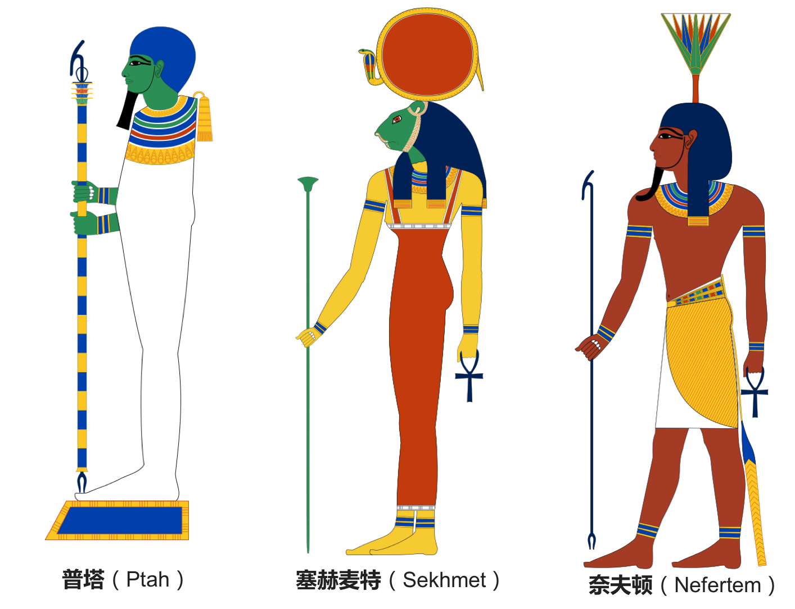
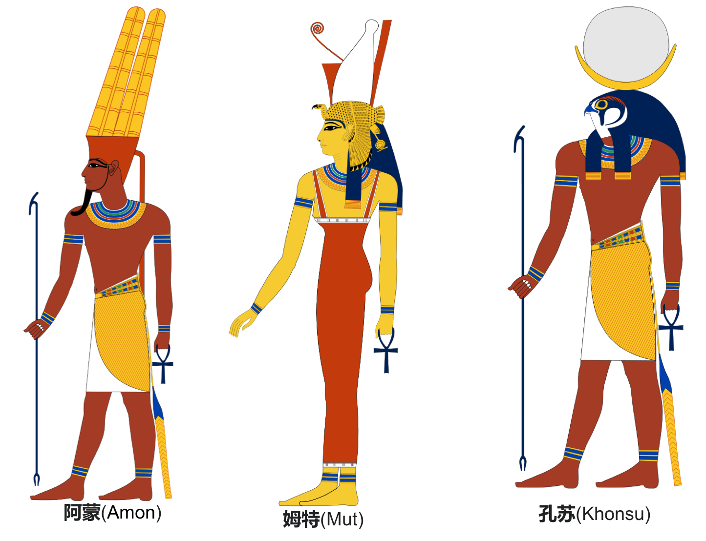
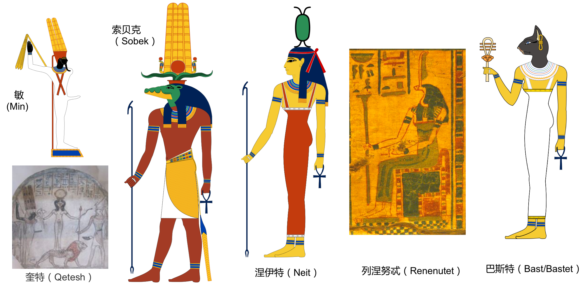

#  埃及神话—— Egypt Gods

## 赫利奥波利斯(**Heliopolis**)神学
### [创世纪——九柱神以及主神](Egypt_Gods_1-genesis.md)
###  [拉神](Egypt_Gods_2-ra.md)
### [欧西里斯、伊西斯、荷鲁斯的故事](Egypt_Gods_3-osiris.md)
### 其他神以及故事

普塔（Ptah）：孟斐斯三柱神之首，工匠与艺术之神。普塔放于神庙内殿的基座上。头部被带紧裹，身体被木乃伊包布绑缚。只有双手未被束缚，握持着象征生命（安卡），稳定（节德）与全能的复合权杖。有时，他会以一个畸形的矮子形象展现，手脚弯曲，脑袋硕大，除了一束童发外全部剃光。
塞赫麦特（Sekhmet）：母狮神，孟斐斯三柱神之一。最初是战争女神及上埃及的医疗女神。塞赫麦特也是一位太阳神，有时也被称作太阳神拉（Ra）的女儿，常与哈托尔和贝斯特二位女神混同。
奈夫顿（涅斐尔图姆）（Nefertem）：植物神，孟斐斯三柱神之一，普塔和塞赫麦特之子。

阿蒙（Amon）：底比斯三柱神之首。埃及主神的希腊化名字。前三个创世神话中诸神的所有神迹改为阿蒙的功绩，使底比斯的主神权力变大。阿蒙被描绘为人形，头戴一个头箍，由头箍上笔直伸出两根平行羽饰。这可能象征着鹰的尾羽。阿蒙有两种常见的形象：一种是坐在王座中，另一种是站着，手持一根鞭子，很像科普托斯和齐米斯的神祇敏。后者可能是他的原始形象：生育之神。国王在他面前隆重地耕耘将要播种的土地或收割成熟的谷物
姆特（Mut/Golden Dawn，Auramooth）：底比斯三柱神之一，阿蒙的妻子。
孔斯（Khons/Chons）：底比斯三柱神之一，阿蒙与姆特之子，月神。孔苏通常都以木乃伊的形象出现，以小孩子的造型出现时，表示新月，以成年男子的形象出现时，则表示满月。有时候，他的头部被描绘成与荷鲁斯相似的隼头，戴着与拉头上日轮相似的月轮

敏（Min/Menu，Amsu）:旅行者的守护神，亦司掌生产及收获。是古埃及神话中男性生殖的守护神，沙漠旅行人的守护者，也是孩童的保护者。其特色是勃起的阴茎，全名是Menu-ka-mut-f（"Min, Bull of his Mother"），是很男性化的神，通常人们把莴苣当成祭品献给他，吃掉后便能获得成年的标志（成年礼）。乃爱之女神奎特的丈夫。绘有他神像的画往往会在旁加上称之为“敏的庭院”的莴苣丛。
奎特（Qetesh）:本为叙利亚的神祇，是古埃及神话中的女神。通常以一美丽的裸女站或坐在狮子上，手上握着花，镜或蛇的形象，以正面出现（和一般埃及壁画不同），敏之妻。
索贝克（Sobek）：鳄鱼神。是古埃及神话中的鳄鱼神，在法尤姆地区受到尊崇，到埃及中王国时期他的信仰被普及，并成为地方主神。以鳄鱼首人身的形象出现。据说索贝克是赛特和涅伊特之子（还有一种说法是尼罗河三角洲守护女神的儿子），他曾保护年幼的荷鲁斯，协助伊西斯和奈芙蒂斯对抗赛特
涅伊特（Neit）：狩猎与编织之神，索贝克之母。埃及女神涅伊特佩戴战争女神符号，头顶一只交叉着两支箭的盾牌，手拿安卡架(Ankh)和“沃斯”(was)权杖。有时，她戴着下埃及红色王冠。
列涅努忒（Renenutet）：食物和收获女神，索贝克的妻子。列涅努忒特被想像为一条眼镜蛇，或是头上带一条眼镜蛇的女人.
巴斯特（Bast/Bastet）：猫神，杀死了阿蒙拉最大的敌人混沌毒蛇阿佩普。在希腊统治的时期，更进一步被转化成代表月亮的神明。芭丝特作为下埃及的守护神，曾被视为法老的守护者，但她的地位后来被拉所取代，于是她和其他狮子女神（包括泰芙努特，塞赫麦特，哈托尔等等）都被视为拉之眼（Eye of Ra），也就是太阳神的从属。因此，不少壁画都描绘她和太阳神拉的大敌，混沌之蛇阿佩普展开战斗

其他主要的神：
- 阿蒙（Ammon）：底比斯主神。原为赫尔莫波利斯供奉的八元神中象征“隐蔽”的神。
- 凯布利（Khepri）：圣甲虫，早晨的太阳神。
- 阿顿（Aton）：正午之太阳神。形象为伸出数只手的太阳圆盘。
- 亚图姆（Atum）：暮之太阳神，亦是赫利奥波利斯的主神，拉的别名。
- 荷鲁斯（Horus）：法老的守护神、天空之神，王权的象征。外形为鹰头人身。
- 阿努比斯（Anubis）：死神、制作木乃伊的神。外形为胡狼头人身。
- 姆特（Mut；Golden Dawn，Auramooth）：阿蒙之妻，司掌战争。
- 孔斯（Khons/Chons）：阿蒙与姆特之子，月神，亦司掌医药。
- 哈索尔（Hathor/Het-Heru，Het-Hert）：荷鲁斯之妻，司爱情、音乐、欢乐及丰饶。
- 普塔（Ptah）：创造之神，孟菲斯主神，亦是工匠的守护神。
- 托特（Thoth）：智慧之神。外型为朱鹭头人身或狒狒。
- 玛特（Maat）：正义及秩序之神。

动物神：
- 阿佩普（Apep）：代表破坏、混乱的蛇。
- 芭丝特（Bast/Bastet）：猫之女神，掌管家庭和乐。
- 奈赫贝特（Nekhbet）：秃鹰神，上埃及的象征及守护神。
- 瓦吉特（Wadjet）：蛇神，下埃及的象征及守护神。
- 海奎特（Heqet）：蛙女神，生命女神，为新生的胎儿注入生命。
- 蒙图（Monthu/Mont，Menthu）：司战争。外形为鹰首人身或公牛头人身。
- 库努牡（Khnum）：公羊神，以黏土创造人类以及各种动物。
- 塞赫麦特（Sekhmet）：母狮神，普塔之妻，掌管战争、疾病及恶灵。
- 塞尔凯特（Serket/Selket）：蝎子女神，与医术有所关联，四位守护死者的女神之一。
- 索贝克（Sobek）：鳄鱼神，战争之神，王权的守护神。
- 麦里特塞盖尔（Meretseger）：眼镜蛇女神，陵墓的守护神。
- 阿匹斯（Apis）：司丰饶及生产之神，为普塔或欧西里斯的化身，外形为公牛。
- 玛弗德特( Maftet):是对抗蛇和蝎子的女神，拉神之女，其形象常常被画成某种猫或猫鼬.由于猫能消灭蝎子和蛇等毒虫，玛弗德特被看作是一位猫女神.她被赋予了一个称号：“毒蛇杀手”。
- 斯芬克斯（Sphinx）：最初源于古埃及的神话，是长有翅膀的怪物，通常为雄性，当时的传说中有三种斯芬克斯——人面狮身的Androsphinx、羊头狮身的Criosphinx（阿曼的圣物）、鹰头狮身的Hieracosphinx。亚述人和波斯人则把斯芬克斯描述为一只长有翅膀的公牛，长着人面、络腮胡子，戴有皇冠。到了希腊神话，斯芬克斯却变成雌性的邪恶之物，代表“神的惩罚”。在希腊神话中，赫拉派斯芬克斯坐在忒拜城附近的悬崖上，拦住过往的路人，用缪斯所传授的谜语问他们，猜不中者就会被它吃掉，这个谜语是：“什么动物早晨用四条腿走路，中午用两条腿走路，晚上用三条腿走路？腿最多的时候，也正是他走路最慢，体力最弱的时候。”俄狄浦斯猜中了正确答案，谜底是“人”。斯芬克斯羞愧万分，投海自溺而死（一说为被俄狄浦斯所杀）。

其他神：
- 努恩（Nun/Nu）：原初之水。
- 哈皮（Hapi）：尼罗河神，有两个身体以及象征丰饶的大乳房及大肚子。
- 阿努凯特（Anuket）：尼罗河神。
- 贝斯（Bes）：音乐神、守护神，神格复杂。
- 哈尔波克拉特斯（Harpocrates/Hor-pa-kraat；Golden Dawn，Hoor-par-kraat）：孩提时荷鲁斯的称呼。
- 荷鲁斯的四个儿子（Four Sons of Horus）：冥王身体以及卡诺卜罐的守护者。
- 艾姆谢特（Imset，Amset，Mesta）：荷鲁斯四子之一，死者肝脏的保护者。
- 哈碧（Hapi，Golden Dawn，Ahephi）：荷鲁斯四子之一，死者肺的保护者。
- 多姆泰夫（Duamutef，Tuamutef；Golden Dawn，Thmoomathph）：荷鲁斯四子之一，死者胃的保护者。
- 凯布山纳夫（Qebshenuf，Kebechsenef，Kebehsenuf，Qebehsenuf）：荷鲁斯四子之一，死者肠的保护者。
- 印和阗（Imhotep/Imouthis）：医药及建筑的守护神，设计了第一座金字塔。
- 梅杰德（Medjed）：记载在死者之书中的小神。
- 敏（Min/Menu，Amsu）：旅行者的守护神及精液与阳具之神，亦司掌生产及收获。
- 涅伊特（Neith/Net，Neit；Gold Dawn，Thoum-aesh-neith）：司战争、狩猎、编织及智慧之神，四位守护死者的女神之一。
- 奎特什（Qetesh）：司爱情及美丽之神。
- 瑟克（Seker）：死亡之神。
- 绍席斯（Saosis）：拥有一棵生命之树的女神。许多神祇（尤其是荷鲁斯）都由她的树中诞生。
- 萨提斯（Satis）：洪水之神。

##### [ 上一篇--其他神以及故事](Egypt_Gods_3-osiris.md)

## Reference
> 1. [尼罗河流域文明(*百度百科*)](https://baike.baidu.com/item/%E5%8F%A4%E5%9F%83%E5%8F%8A%E6%96%87%E6%98%8E/744297?fromtitle=%E5%B0%BC%E7%BD%97%E6%B2%B3%E6%B5%81%E5%9F%9F%E6%96%87%E6%98%8E&fromid=3246788)
> 2. [ancientegypt.co.uk](http://www.ancientegypt.co.uk/gods/story/main.html)
> 3. [埃及神话故事](http://www.shenhuagushi.net/aijishenhua/list_52.html)
> 4. [维基百科-Egyptian_mythology](https://en.wikipedia.org/wiki/Egyptian_mythology)
