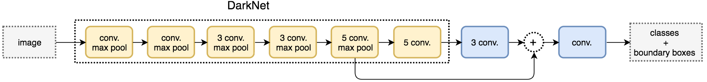

## anchor-base 方法：

### fasterRCNN：

- 1、two-stage，先训练 RPN，再训练 head 网络分支
- 2、feature map 分辨率低，M/2^5,对小目标检测效果有限
- 3、feature map 每个点都有anchor，anchor大小9种（3 scale * 3 ratio）

原图800x600，VGG下采样16倍，feature map每个点设置9个Anchor，所以50*38*9=17100
- 4、正负样例（positive:IOU>0.7, negative:IOU<0.3）
- 5、NMS

### YOLOv3

- 1、	one-stage
- 2、	沙漏形网络，分辨率升高
- 3、	Anchor 不同分辨率下不同 scale 的 anchor

对于一个输入图像，比如416*416*3，相应的会输出 13*13*3 + 26*26*3 + 52*52*3 = 10647 个预测框
- 4、NMS

## Anchor-free

- 1、	region proposal 是检测最重要的步骤，但是从生物学角度，人眼看到物体是同时定位+物体区域
- 2、	物体可以用关键点来代替（降维：二维----->一维）

## reference
1. [yolov3算法精讲](https://www.cnblogs.com/ywheunji/p/10809695.html)
2. [物体检测丨Faster R-CNN详解](https://www.cnblogs.com/vincent1997/p/10889171.html)
3. [Object Detection and Classification using R-CNNs](https://www.telesens.co/2018/03/11/object-detection-and-classification-using-r-cnns/)
4. [YOLOv3 算法的一点理解](https://yunyang1994.gitee.io/2018/12/28/YOLOv3/)
