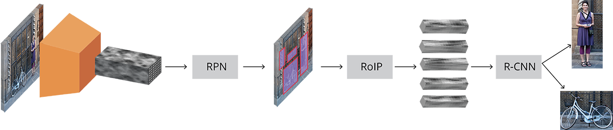

## anchor-base 方法：

### fasterRCNN：

#### 注意问题
1. 权重初始化

     m.weight.data.normal_(0, math.sqrt(2. / n))，
     
     其中n为样本数据，对于每一层来说W来说，n就是前一层输出到这个节点连接的输入样本数量。
     [具体推导细节](https://www.telesens.co/2018/04/09/initializing-weights-for-the-convolutional-and-fully-connected-layers/)
  
  
2.   Region Proposal Network(RPN)
  
     RPN网络只训练区分前景和背景Bbox，正负样例（positive:IOU>0.7, negative:IOU<0.3），故分类为2分类
        
     RPN Loss：RPN损失函数是在优化过程中最小化以训练RPN网络的指标。损失函数是以下组合
        
        1、RPN生成的bounding boxes被正确分类为前景/背景的比例
        2、预测和目标回归系数之间的距离度量。
3. position loss

     

#### FasterRCNN 特点
- 1、two-stage，先训练 RPN，再训练 head 网络分支
- 2、feature map 分辨率低，M/2^5,对小目标检测效果有限
- 3、feature map 每个点都有anchor，anchor大小9种（3 scale * 3 ratio）

原图800x600，VGG下采样16倍，feature map每个点设置9个Anchor，所以50*38*9=17100
- 4、正负样例（positive:IOU>0.7, negative:IOU<0.3）
- 5、NMS

### YOLOv3
作者在YOLO算法中把物体检测（object detection）问题处理成回归问题，并将图像分为S×S的网格。如果一个目标的中心落入格子，该格子就负责检测该目标。

每个网格都会输出 bounding box，confidence 和 class probability map。其中：
- 1. bounding box 包含4个值：x，y，w，h，（x，y）代表 box 的中心。（w，h）代表 box 的宽和高；
- 2. confidence 表示这个预测框中包含物体的概率，其实也是预测框与真实框之间的 iou 值;
- 3. class probability 表示的是该物体的类别概率，在 YOLOv3 中采用的是二分类的方法。

- 1、	one-stage
- 2、	沙漏形网络，分辨率升高
- 3、	Anchor 不同分辨率下不同 scale 的 anchor

对于一个输入图像，比如416*416*3，相应的会输出 13*13*3 + 26*26*3 + 52*52*3 = 10647 个预测框
- 4、NMS

#### 注意问题
1. 使用Kmeans聚类的方法先验确定anchors的尺寸大小

     YOLO2已经开始采用K-means聚类得到先验框的尺寸，YOLO3延续了这种方法，其实就是使用 k-means 算法对训练集上的 boudnding box 尺度做聚类。
     
     此外，考虑到训练集上的图片尺寸不一，因此对此过程进行归一化处理。
     
     由于在 YOLOv3 算法为每种下采样尺度设定3种先验框，里一共有3种尺度预测，因此只能是3的倍数，所以最终选择了 9 个先验框,总共聚类出9种尺寸的先验框。
     在COCO数据集这9个先验框是：(10x13)，(16x30)，(33x23)，(30x61)，(62x45)，(59x119)，(116x90)，(156x198)，(373x326)。
     
     k-means 度量距离的选取很关键。距离度量如果使用标准的欧氏距离，大框框就会比小框产生更多的错误。 Kmeans聚类度量方式为IOU。
     
     分配上，在最小的13*13特征图上（有最大的感受野）应用较大的先验框(116x90)，(156x198)，(373x326)，适合检测较大的对象。中等的26*26
     特征图上（中等感受野）应用中等的先验框(30x61)，(62x45)，(59x119)，适合检测中等大小的对象。较大的52*52特征图上（较小的感受野）应用
     较小的先验框(10x13)，(16x30)，(33x23)，适合检测较小的对象
     
     
2. bbox的预测
     yolo v3对bbox进行预测的时候，采用了logistic regression。yolo v3每次对b-box进行predict时，输出和v2一样都是(tx,ty,tw,th,to), 然后通过公式1计算出绝对的(x, y, w, h, c)。
     
     logistic回归用于对anchor包围的部分进行一个目标性评分(objectness score)，（用于NMS），即这块位置是目标的可能性有多大。
     
     v3预测bbox只预测一个最准确的；在训练过程中yolov3是预测9个anchors的，对于loss的计算是找到iou最大的哪个，但是预测的时候只选一个最精确的。
3. 对象分类softmax改成logistic
     预测对象类别时不使用softmax，改成使用logistic的输出进行预测。这样能够支持多标签对象（比如一个人有Woman 和 Person两个标签） 
4. decode处理
     YOLOv3 网络的三个分支输出会被送入 decode 函数中对 Feature Map 的通道信息进行解码。 在下面这幅图里：黑色虚线框代表先验框(anchor)，蓝色框表示的是预测框.
     
     
     
     $\text{b}\_{h}$ 和 $\text{b}\_{w}$ 分别表示预测框的长宽, $\text{P}\_{h}$ 和 $\text{P}\_{w}$ 分别表示先验框的长和宽。
     
     $\text{t}\_{x}$ 和 $\text{t}\_{y}$ 分别表示物体中心距离网格左上角位置的偏移量, $\text{C}\_{x}$ 和 $\text{C}\_{y}$ 分别表示网格左上角的坐标。
5. NMS 
     在 YOLO 算法中，NMS 的处理有两种情况：一种是所有的预测框一起做 NMS 处理，另一种情况是分别对每个类别的预测框做 NMS 处理。后者会出现一个预测框既属于类别 A 又属于类别 B 的现象，这比较适合     于一个小单元格中同时存在多个物体的情况。
6. 正负样本分配
     * 如果 Anchor 与 Ground-truth Bounding Boxes 的 IoU > 0.3，标定为正样本;
     * 在第 1 种规则下基本能够产生足够多的样本，但是如果它们的 iou 不大于 0.3，那么只能把 iou 最大的那个 Anchor 标记为正样本，这样便能保证每个 Ground-truth 框都至少匹配一个先验框
     
     按照上述原则，一个 ground-truth 框会同时与多个先验框进行匹配。
     
     为什么不能只用 iou 最大的 anchor 去负责预测该物体？
     
     答：如果按照这种原则去分配正负样本，那么势必会导致正负样本的数量极其不均衡（正样本特别少，负样本特别多），这将使得模型在预测时会出现大量漏检的情况。
     实际上很多目标检测网络都会避免这种情况，并     且尽量保持正负样本的数目相平衡。
     例如，SSD 网络就使用了 hard negative mining 的方法对负样本进行抽样，抽样时按照置信度误差（预测背景的置信度越小，误差越大）进行降序排列，选取误差较大的 top-k 作为训练的负样本，以保证正负样本的比例接近1:3。
7. 损失函数
     在 YOLOv3 中，作者将目标检测任务看作目标区域预测和类别预测的回归问题, 因此它的损失函数也有些与众不同。
     * 置信度损失，判断预测框有无物体；
     
       如果一个预测框与所有真实框的 iou 都小于某个阈值，那么就判定它是背景，否则为前景（包含物体），这类似于在 Faster rcnn 里 RPN 功能。
     * 框回归损失，仅当预测框内包含物体时计算；
       - 边界框的尺寸越小，bbox_loss_scale 的值就越大。实际上，我们知道 YOLOv1 里作者在 loss 里对宽高都做了开根号处理，这是为了弱化边界框尺寸对损失值的影响
       - respond_bbox 的意思是如果网格单元中包含物体，那么就会计算边界框损失
       - 两个边界框之间的 GIoU 值越大，giou 的损失值就会越小, 因此网络会朝着预测框与真实框重叠度较高的方向去优化。
     * 分类损失，判断预测框内的物体属于哪个类别
          
       这里分类损失采用的是二分类的交叉熵，即把所有类别的分类问题归结为是否属于这个类别，这样就把多分类看做是二分类问题。
       这样做的好处在于排除了类别的互斥性，特别是解决了因多个类别物体的重叠而出现漏检的问题。
8. GIoU
     边界框一般由左上角和右下角坐标所表示，即 (x1,y1,x2,y2)。那么，你发现这其实也是一个向量。向量的距离一般可以 L1 范数或者 L2 范数来度量。
     但是在L1及L2范数取到相同的值时，实际上检测效果却是差异巨大的，直接表现就是预测和真实检测框的IoU值变化较大，这说明L1和L2范数不能很好的反映检测效果。
     
     当 L1 或 L2 范数都相同的时候，发现 IoU 和 GIoU 的值差别都很大，这表明使用 L 范数来度量边界框的距离是不合适的。
     
     在这种情况下，学术界普遍使用 IoU 来衡量两个边界框之间的相似性。作者发现使用 IoU 会有两个缺点，导致其不太适合做损失函数:
     * 预测框和真实框之间没有重合时，IoU 值为 0， 导致优化损失函数时梯度也为 0，意味着无法优化。
     
       例如，场景 A 和场景 B 的 IoU 值都为 0，但是显然场景 B 的预测效果较 A 更佳，因为两个边界框的距离更近( L 范数更小)
       
       
     * 即使预测框和真实框之间相重合且具有相同的 IoU 值时，检测的效果也具有较大差异，如下图所示。
       
       
 
## Anchor-free

- 1、	region proposal 是检测最重要的步骤，但是从生物学角度，人眼看到物体是同时定位+物体区域
- 2、	物体可以用关键点来代替（降维：二维----->一维）

## reference
1. [yolov3算法精讲](https://www.cnblogs.com/ywheunji/p/10809695.html)
2. [物体检测丨Faster R-CNN详解](https://www.cnblogs.com/vincent1997/p/10889171.html)
3. [Object Detection and Classification using R-CNNs](https://www.telesens.co/2018/03/11/object-detection-and-classification-using-r-cnns/)
4. [YOLOv3 算法的一点理解](https://yunyang1994.gitee.io/2018/12/28/YOLOv3/)
