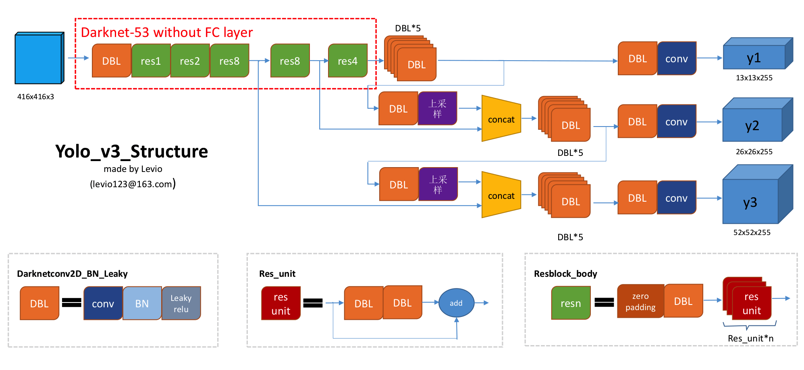

## anchor-base 方法：

## fasterRCNN：


- 1、two-stage，先训练 RPN，再训练 head 网络分支
- 2、feature map 分辨率低，M/2^5,对小目标检测效果有限
- 3、feature map 每个点都有anchor，anchor大小9种（3 scale x 3 ratio）
- 4、RPN阶段正负样例（positive:IOU > 0.7, negative:IOU < 0.3）和分类时候的正负样例不同，且不同阶段参与loss计算的方式不一样
- 5、NMS

#### 注意问题
1. 权重初始化

     m.weight.data.normal_(0, math.sqrt(2. / n))，
     
     其中n为样本数据，对于每一层来说W来说，n就是前一层输出到这个节点连接的输入样本数量。
     [具体推导细节](https://www.telesens.co/2018/04/09/initializing-weights-for-the-convolutional-and-fully-connected-layers/)
  
  
2.   Region Proposal Network(RPN)
  
     RPN网络只训练区分前景和背景Bbox，正负样例（positive:IOU > 0.7, negative:IOU < 0.3），故分类为2分类
        
     RPN Loss：RPN损失函数是在优化过程中最小化以训练RPN网络的指标。损失函数是以下组合
        
        1、RPN生成的bounding boxes被正确分类为前景/背景的比例
        2、预测和目标回归系数之间的距离度量。
3. position loss  
     两组bounding box回归系数之间的差异  
     *  一组由RPN网络产生  
          用于训练RPN层以产生良好的前景bounding boxes（更紧密地围绕对象边界）。目标回归系数，即将ROI框与其最接近的ground truth的bounding box对齐所需的系数由anchor target layer生成   
     *  一组由HEAD网络产生
          第二组bounding box系数由分类层生成。这些系数是类特定的，即对于每个ROI框，每个对象类生成一组系数。这些目标回归系数由proposal target layer生成。注意，分类网络在方形feature map上操作，该方形feature map是应用于head网络输出的仿射变换（如上所述）的结果。然而，由于回归系数对于没有剪切的仿射变换是不变的，因此可以将由proposal target layer计算的目标回归系数与由分类网络产生的目标回归系数进行比较，并且充当有效学习信号。  

       
     x, y, w, h 分别表示 boxes 的中心坐标和宽高；变量 x, x_{a}, x^{*} 则分别代表预测框，anchor 框和 ground-truth 框的中心坐标 x   
4. Loss
    
    
5. NMS  
- 1. RPN网络种的Proposal Layer阶段，featureMap上每个像素点9种不同尺寸的bbox根据预测回归系数得到转换后的anchor，然后利用NMS修剪bbox作为前景bbox  
6. predict_box & anchor_box  & ground-truth_box 之间的关系
     - RPN网络是去拟合anchor_box  & 与它最近（度量为IOU）ground-truth_box 之间的偏差，anchor_box  & ground-truth_box之间通过IOU大小划分正负anchor样本
     - RPN中的predict_box & ground-truth_box之间去计算回传loss
     - HEAD层中的predict_box是拟合每一个具体类别所属的box和修正过的anchor_box之间的偏差，也就是inference过程中的预测值


#### FasterRCNN 特点
- **RPN网络的inference**
     - 【Anchor Generation Layer】层生成9中不同比例的anchor， 然后在featureMap上像素点为参照，对应到原图上anchor大小，每一个featureMap的点都对应9种不同尺寸的anchor  
        
     原图800x600，VGG下采样16倍，feature map每个点设置9个Anchor，所以50x38x9=17100  
     - 【Proposal Layer】根据bounding boxes回归系数转换anchor以生成转换后的anchors。然后利用anchor作为前景的概率应用非极大值抑制来修剪anchor的数量。  
       
     - 【Proposal Target Layer】   
     生成后续head层训练ground-truth数据。目标是修剪proposal layer生成的anchor列表（包含bbox在featureMap上的精确位置插值等等），并生成特定类的bounding  box回归目标(后面的head bbox回归层训练用到)，可用于训练分类层以生成良好的类别标签和回归目标   
     
     使用每个ROI与所有groud truth boxes的最大重叠，它将ROI分类为背景和前景ROI。前景ROI是最大重叠超过阈值的那些（TRAIN.FG_THRESH，默认值：0.5）。背景ROI是最大重叠落在TRAIN.BG_THRESH_LO和TRAIN.BG_THRESH_HI之间的值（默认值分别为0.1,0.5）。这是用于向分类器提供困难背景样本的“难例挖掘”的示例。  
     接下来，在每个ROI和最接近的匹配ground truth box之间计算bounding box目标回归目标（这也包括背景ROI，因为这些ROI也存在重叠的ground truth）。这些回归目标针对所有类进行了扩展，如下图所示。  
     背景ROI（困难样本）的回归系数ground-truth值均为0，回归过程就是把这些背景ROI逼近到0，也就是使得模型尽量不预测出这些背景区域。  
     
     
     **输入**: proposal layer生成的ROI + ground truth信息  
     **输出**:  选择符合重叠标准的前景和背景ROI。 + ROI的类特定目标回归系数    
     **参数**：     
          *  TRAIN.FG_THRESH :(默认值：0.5）用于选择前景ROI。与ground truth最大重叠超过FG_THRESH的ROI标记为前景  
          *  TRAIN.BG_THRESH_HI :(默认为0.5）  
          *  TRAIN.BG_THRESH_LO:(默认为0.1）这两个阈值用于选择背景ROI。最大重叠位于BG_THRESH_HI和BG_THRESH_LO之间的ROI标记为背景  
          *  TRAIN.BATCH_SIZE :(默认为128）所选的前景和背景框的最大数量。  
          *  TRAIN.FG_FRACTION :(默认为0.25）。前景框的数量不能超过BATCH_SIZE * FG_FRACTION。如果找到的背景区域太少，它会尝试通过随机重复一些背景索引来填补批次，以弥补不足。  

- **RPN网络的trainning**
- 1. 【Anchor Target Layer】 生成RPN网络训练过程中的所需数据    
      **输入**: RPN网络输出（预测的前景/背景类标签，回归系数）+ Anchor boxes（由anchor generation layer生成） + Ground truth boxes  
      **输出**: 良好的前景/背景框和相关的类标签 + 目标回归系数   
      **预测值**：为背景/前景二分类概率值， 所有前景bbox的回归系数   
      
      **ground-truth**：   
          为正样本【featureMap每个像素9个尺寸形成所有anchors与所有前景bbox中IOU>0.7的anchor】  
          负样本【所有anchors与所有前景bbox中IOU<0.3的anchors】  
          既不是前景也不是背景的框（RPN_NEGATIVE_OVERLAP < 重叠 < RPN_POSITIVE_OVERLAP的框）被标记为“不关心”。这些框不包括在RPN损失的计算中。     
      
      其中ground-truth 正样本中分为两种类型:  
          **类型A**：对于每个ground truth box，所有与ground truth box具有最大IoU重叠的前景框  
           **类型B**：与某些ground truth box的最大重叠超过阈值的Anchor boxes。 
      **参数**  
      TRAIN.RPN_BATCHSIZE：背景和前景anchor的总数（默认值：256）  
      TRAIN.RPN_FG_FRACTION：batch size中前景anchor的比例（默认值：0.5）。如果找到的前景anchors大于TRAIN.RPN_BATCHSIZE×TRAIN.RPN_FG_FRACTION，则超出（索引是随机选择的）标记为“不关心”。  
      
- 2. 【RPN Loss】  
      RPN生成的bounding boxes被正确分类为前景/背景的比例, 分类损失使用交叉熵损失惩罚错误分类的框  
      预测和目标回归系数之间的距离度量, 回归损失使用真实回归系数之间的距离函数smoothL1距离（使用前景anchor最近匹配的ground truth计算）和网络预测的回归系数  
- **HEAD层训练**
- 1. 【ROI Pooling Layer】  
      实现空间转换的网络，在给定proposal target layer生成的region proposals的bounding boxes坐标的情况下对输入feature map进行采样。这些坐标通常不在整数边界上，因此需要基于插值的采样  
- 2. 【classification layer】  
      方形feature maps通过沿空间维度的aaverage pooling，将feature map传递到ResNet的layer 4，得到（代码中称为“fc7”）是每个ROI的一维特征向量。  特征向量通过两个全连接得到（N x 21 + N x 4）  


---


## YOLOv3
作者在YOLO算法中把物体检测（object detection）问题处理成回归问题，并将图像分为S×S的网格。如果一个目标的中心落入格子，该格子就负责检测该目标。

每个网格都会输出 bounding box，confidence 和 class probability map。其中：
- 1. bounding box 包含4个值：x，y，w，h，（x，y）代表 box 的中心。（w，h）代表 box 的宽和高；
- 2. confidence 表示这个预测框中包含物体的概率，其实也是预测框与真实框之间的 iou 值;
- 3. class probability 表示的是该物体的类别概率，在 YOLOv3 中采用的是二分类的方法。


- 1、	one-stage
- 2、	沙漏形网络，分辨率升高
- 3、	Anchor 不同分辨率下不同 scale 的 anchor




对于一个输入图像，比如416 x 416 x 3，相应的会输出 13x13x3 + 26x26x3 + 52x52x3 = 10647 个预测框
- 4、NMS

#### 注意问题
1. 使用Kmeans聚类的方法先验确定anchors的尺寸大小

     YOLO2已经开始采用K-means聚类得到先验框的尺寸，YOLO3延续了这种方法，其实就是使用 k-means 算法对训练集上的 boudnding box 尺度做聚类。
     
     此外，考虑到训练集上的图片尺寸不一，因此对此过程进行归一化处理。
     
     由于在 YOLOv3 算法为每种下采样尺度设定3种先验框，里一共有3种尺度预测，因此只能是3的倍数，所以最终选择了 9 个先验框,总共聚类出9种尺寸的先验框。
     在COCO数据集这9个先验框是：(10x13)，(16x30)，(33x23)，(30x61)，(62x45)，(59x119)，(116x90)，(156x198)，(373x326)。
     
     k-means 度量距离的选取很关键。距离度量如果使用标准的欧氏距离，大框框就会比小框产生更多的错误。 Kmeans聚类度量方式为IOU。
     
     分配上，在最小的13x13特征图上（有最大的感受野）应用较大的先验框(116x90)，(156x198)，(373x326)，适合检测较大的对象。中等的26x26
     特征图上（中等感受野）应用中等的先验框(30x61)，(62x45)，(59x119)，适合检测中等大小的对象。较大的52*52特征图上（较小的感受野）应用
     较小的先验框(10x13)，(16x30)，(33x23)，适合检测较小的对象
     
     
2. bbox的预测

     yolo v3对bbox进行预测的时候，采用了logistic regression。yolo v3每次对b-box进行predict时，输出和v2一样都是(tx,ty,tw,th,to), 然后通过公式1计算出绝对的(x, y, w, h, c)。
     
     logistic回归用于对anchor包围的部分进行一个目标性评分(objectness score)，（用于NMS），即这块位置是目标的可能性有多大。
     
     v3预测bbox只预测一个最准确的；在训练过程中yolov3是预测9个anchors的，对于loss的计算是找到iou最大的哪个，但是预测的时候只选一个最精确的。  
     
3. 对象分类softmax改成logistic  
     预测对象类别时不使用softmax，改成使用logistic的输出进行预测。这样能够支持多标签对象（比如一个人有Woman 和 Person两个标签） 
     
4. decode处理  
     YOLOv3 网络的三个分支输出会被送入 decode 函数中对 Feature Map 的通道信息进行解码。 在下面这幅图里：GT如红色的框所示，Anchor如紫色的框所示, 黑色虚线框代表先验框(anchor)，蓝色框表示的是预测框.   
       
     $\text{b}\_{h}$ 和 $\text{b}\_{w}$ 分别表示预测框的长宽, $\text{P}\_{h}$ 和 $\text{P}\_{w}$ 分别表示先验框的长和宽。  
     $\text{t}\_{x}$ 和 $\text{t}\_{y}$ 分别表示物体中心距离网格左上角位置的偏移量, $\text{C}\_{x}$ 和 $\text{C}\_{y}$ 分别表示网格左上角的坐标。  
     ```
       
     def decode(conv_output, i=0):
         # 这里的 i=0、1 或者 2， 以分别对应三种网格尺度
         conv_shape  = tf.shape(conv_output)
         batch_size  = conv_shape[0]
         output_size = conv_shape[1]
         conv_output = tf.reshape(conv_output, (batch_size, output_size, 
                                                output_size, 3, 5 + NUM_CLASS))
         conv_raw_dxdy = conv_output[:, :, :, :, 0:2] # 中心位置的偏移量
         conv_raw_dwdh = conv_output[:, :, :, :, 2:4] # 预测框长宽的偏移量
         conv_raw_conf = conv_output[:, :, :, :, 4:5] # 预测框的置信度
         conv_raw_prob = conv_output[:, :, :, :, 5: ] # 预测框的类别概率
         # 好了，接下来需要画网格了。其中，output_size 等于 13、26 或者 52
         y = tf.tile(tf.range(output_size, dtype=tf.int32)[:, tf.newaxis], [1, output_size])
         x = tf.tile(tf.range(output_size, dtype=tf.int32)[tf.newaxis, :], [output_size, 1])
         xy_grid = tf.concat([x[:, :, tf.newaxis], y[:, :, tf.newaxis]], axis=-1)
         xy_grid = tf.tile(xy_grid[tf.newaxis, :, :, tf.newaxis, :], [batch_size, 1, 1, 3, 1])
         xy_grid = tf.cast(xy_grid, tf.float32) # 计算网格左上角的位置
         # 根据上图公式计算预测框的中心位置
         pred_xy = (tf.sigmoid(conv_raw_dxdy) + xy_grid) * STRIDES[i]
         # 根据上图公式计算预测框的长和宽大小
         pred_wh = (tf.exp(conv_raw_dwdh) * ANCHORS[i]) * STRIDES[i]
         pred_xywh = tf.concat([pred_xy, pred_wh], axis=-1) 
         pred_conf = tf.sigmoid(conv_raw_conf) # 计算预测框里object的置信度
         pred_prob = tf.sigmoid(conv_raw_prob) # 计算预测框里object的类别概率
         return tf.concat([pred_xywh, pred_conf, pred_prob], axis=-1)
     ```
5. NMS 
     在 YOLO 算法中，NMS 的处理有两种情况：
     - 一种是所有的预测框一起做 NMS 处理  
     - 另一种情况是分别对每个类别的预测框做 NMS 处理  
     后者会出现一个预测框既属于类别 A 又属于类别 B 的现象，这比较适合于一个小单元格中同时存在多个物体的情况。  
     
6. 正负样本分配
     * 如果 Anchor 与 Ground-truth Bounding Boxes 的 IoU > 0.3，标定为正样本;
     * 在第 1 种规则下基本能够产生足够多的样本，但是如果它们的 iou 不大于 0.3，那么只能把 iou 最大的那个 Anchor 标记为正样本，这样便能保证每个 Ground-truth 框都至少匹配一个先验框
     
     按照上述原则，一个 ground-truth 框会同时与多个先验框进行匹配。
     
     为什么不能只用 iou 最大的 anchor 去负责预测该物体？  
     答：如果按照这种原则去分配正负样本，那么势必会导致正负样本的数量极其不均衡（正样本特别少，负样本特别多），这将使得模型在预测时会出现大量漏检的情况。  
     实际上很多目标检测网络都会避免这种情况，并且尽量保持正负样本的数目相平衡。  
     例如，SSD 网络就使用了 hard negative mining 的方法对负样本进行抽样，抽样时按照置信度误差（预测背景的置信度越小，误差越大）进行降序排列，选取误差较大的 top-k 作为训练的负样本，以保证正负样本的比例接近1:3。
     
     ```
     # 流程1: 判断边界框的数目是否大于0
     while len(cls_bboxes) > 0:
         # 流程2: 按照 socre 排序选出评分最大的边界框 A
         max_ind = np.argmax(cls_bboxes[:, 4])
         # 将边界框 A 取出并剔除
         best_bbox = cls_bboxes[max_ind]
         best_bboxes.append(best_bbox)
         cls_bboxes = np.concatenate([cls_bboxes[: max_ind], cls_bboxes[max_ind + 1:]])
         # 流程3: 计算这个边界框 A 与剩下所有边界框的 iou 并剔除那些 iou 值高于阈值的边界框
         iou = bboxes_iou(best_bbox[np.newaxis, :4], cls_bboxes[:, :4])
         weight = np.ones((len(iou),), dtype=np.float32)
         iou_mask = iou > iou_threshold
         weight[iou_mask] = 0.0
         cls_bboxes[:, 4] = cls_bboxes[:, 4] * weight
         score_mask = cls_bboxes[:, 4] > 0.
         cls_bboxes = cls_bboxes[score_mask]
     ```
     
     ```
     # # (5) discard some boxes with low scores
          classes = np.argmax(pred_prob, axis=-1)
          scores = pred_conf * pred_prob[np.arange(len(pred_coor)), classes]
          score_mask = scores > score_threshold
     ```
7. 损失函数
     在 YOLOv3 中，作者将目标检测任务看作目标区域预测和类别预测的回归问题, 因此它的损失函数也有些与众不同。
     * 置信度损失，判断预测框有无物体；【predict_box & groundtruth_box】  
       如果一个预测框与所有真实框的 iou 都小于某个阈值，那么就判定它是背景，否则为前景（包含物体），这类似于在 Faster rcnn 里 RPN 功能。  
       
     * 框回归损失采用GIoU损失函数，仅当预测框内包含物体时计算；
       - 边界框的尺寸越小，bbox_loss_scale 的值就越大。实际上，我们知道 YOLOv1 里作者在 loss 里对宽高都做了开根号处理，这是为了弱化边界框尺寸对损失值的影响
       - respond_bbox 的意思是如果网格单元中包含物体，那么就会计算边界框损失
       - 两个边界框之间的 GIoU 值越大，giou 的损失值就会越小, 因此网络会朝着预测框与真实框重叠度较高的方向去优化。
       ```
        respond_bbox  = label[:, :, :, :, 4:5]  # 置信度，判断网格内有无物体
        ...
        bbox_loss_scale = 2.0 - 1.0 * label_xywh[:, :, :, :, 2:3] * label_xywh[:, :, :, :, 3:4] / (input_size ** 2)
        giou_loss = respond_bbox * bbox_loss_scale * (1 - giou)
       ```  
       
     * 分类损失，判断预测框内的物体属于哪个类别  
       这里分类损失采用的是二分类的交叉熵，即把所有类别的分类问题归结为是否属于这个类别，这样就把多分类看做是二分类问题。
       这样做的好处在于排除了类别的互斥性，特别是解决了因多个类别物体的重叠而出现漏检的问题。  
      
8. GIoU
     边界框一般由左上角和右下角坐标所表示，即 (x1,y1,x2,y2)。那么，你发现这其实也是一个向量。向量的距离一般可以 L1 范数或者 L2 范数来度量。  
     但是在L1及L2范数取到相同的值时，实际上检测效果却是差异巨大的，直接表现就是预测和真实检测框的IoU值变化较大，这说明L1和L2范数不能很好的反映检测效果。  
     当 L1 或 L2 范数都相同的时候，发现 IoU 和 GIoU 的值差别都很大，这表明使用 L 范数来度量边界框的距离是不合适的。  
     
     在这种情况下，学术界普遍使用 IoU 来衡量两个边界框之间的相似性。作者发现使用 IoU 会有两个缺点，导致其不太适合做损失函数:  
     * 预测框和真实框之间没有重合时，IoU 值为 0， 导致优化损失函数时梯度也为 0，意味着无法优化。  
       例如，场景 A 和场景 B 的 IoU 值都为 0，但是显然场景 B 的预测效果较 A 更佳，因为两个边界框的距离更近( L 范数更小)  
         
       
     * 即使预测框和真实框之间相重合且具有相同的 IoU 值时，检测的效果也具有较大差异，如下图所示。  
         
         
       
9. predict_box & anchor_box  & ground-truth_box 之间的关系  
     - anchor_box 和 ground-truth_box之间通过GIOU划分正负样本（positive：>0.7, negtive: <0.3）
     - 把anchor_box移动到np.floor(w,h|ground-truth_box) + 0.5的位置去计算GIOU的
     - anchor_box只关心能不能框到物体，不关心是否准确框到物体
     - predict_box 和 ground-truth_box之间计算回传loss去实现精细准确框偏差  
     - predict_box偏移量是基于Anchor框的宽和高和grid的先验位置的偏移量， 宽高是以anchor的宽高为参照，中心位置以grid为参照
     - （理解有误）~~回归宽高的anchor是和ground-truth最贴合IOU最大的那个作为参照，一个GT只有一个相应的anchor，正样本比例较少~~
     - 一个anchor对应一个gtbox（IOU最大的），但一个gtbox可以对应多个anchor，形成多个gt-anchor组合对进行wh回归loss计算  
     ```
     for i in range(3): # 针对 3 种网格尺寸
         # 设定变量，用于存储每种网格尺寸下 3 个 anchor 框的中心位置和宽高
         anchors_xywh = np.zeros((self.anchor_per_scale, 4))
         # 将这 3 个 anchor 框都偏移至网格中心
         anchors_xywh[:, 0:2] = np.floor(bbox_xywh_scaled[i, 0:2]).astype(np.int32) + 0.5
         # 填充这 3 个 anchor 框的宽和高
         anchors_xywh[:, 2:4] = self.anchors[i]
         # 计算真实框与 3 个 anchor 框之间的 iou 值
         iou_scale = self.bbox_iou(bbox_xywh_scaled[i][np.newaxis, :], anchors_xywh)
         iou.append(iou_scale)
         # 找出 iou 值大于 0.3 的 anchor 框
         iou_mask = iou_scale > 0.3
         exist_positive = False
         if np.any(iou_mask): # 规则 1: 对于那些 iou > 0.3 的 anchor 框，做以下处理
          # 根据真实框的坐标信息来计算所属网格左上角的位置
             xind, yind = np.floor(bbox_xywh_scaled[i, 0:2]).astype(np.int32)
             label[i][yind, xind, iou_mask, :] = 0
             # 填充真实框的中心位置和宽高
             label[i][yind, xind, iou_mask, 0:4] = bbox_xywh
             # 设定置信度为 1.0，表明该网格包含物体
             label[i][yind, xind, iou_mask, 4:5] = 1.0
             # 设置网格内 anchor 框的类别概率，做平滑处理
             label[i][yind, xind, iou_mask, 5:] = smooth_onehot
             exist_positive = True
         if not exist_positive: # 规则 2: 所有 iou 都不大于0.3， 那么只能选择 iou 最大的
          best_anchor_ind = np.argmax(np.array(iou).reshape(-1), axis=-1)
     ```
10. YOLOv3与yolov1-v2的区别
     - YOLO v1一次能检测49个目标，98个框，并且2个框对应一个类别。可以是大目标也可以是小目标。因为输出的尺寸是：[N, 7, 7, 30]。式中N为图片数量，7,7为49个区域(grid)。 30=2 x 5(c,x,y,w,h) + 1 x 20 cls   
     - YOLO v2首先把 7 x 7 个区域改为 13 x 13个区域，每个区域有5个anchor(kmeans聚类得出的超参数)，且每个anchor对应着1个类别，那么，输出的尺寸就应该为：[N,13,13,125]。125=5 x 5(c, x,y,w,h) + 5 x 20cls  
     - YOLO v2的检测头已经由YOLO v1的  7 x 7 个区域改为 13 x 13个区域了，我们看YOLO v3检测头分叉了，分成了3部分(13 x 13, 26 x x26, 52 x 52)  

11. 各个训练过程
     - yolov1的训练
          * 先使用224 * 224的分辨率训练分类网络，再切换到448 * 448的分辨率训练检测网络
     - yolov2的训练
          * 先在 ImageNet 分类数据集上预训练 Darknet-19，此时模型输入为 224 * 224 ，共训练 160 个 epochs。(为什么可以这样训练？因为有GAP)
          * 将网络的输入调整为 448 * 448（注意在测试的时候使用 416 * 416 大小） ，继续在 ImageNet 数据集上 finetune 分类模型，训练 10 个 epochs。注意为什么测试的时候使用大小？答案是：将输入图像大小从448 ×448 更改为 416 ×416 。这将创建奇数空间维度(7×7 v.s 8 ×8 grid cell)。 图片的中心通常被大目标占据。 对于奇数网格单元，可以更容易确定目标所属的位置。对于一些大目标，它们中心点往落入图片中心位置，此时使用特征图中心的1个cell去预测这些目标的bounding box相对容易些，否则就要用中间4个Cells来进行预测。
          * 修改 Darknet-19 分类模型为检测模型,移除最后一个卷积层、global avgpooling 层以及 softmax 层，并且新增了3个 3 * 3 * 1024 卷积层，同时增加了一个 passthrough 层，最后使用 1 * 1 卷积层输出预测结果，并在检测数据集上继续finetune 网络。
     - yolov3的训练
          * darknet 53指的是convolution层有52层+1个conv层把1024个channel调整为1000个， 在ImageNet上先train的backbone，
          * 再观察发现YOLO v3没有Pooling layer了，用的是conv(stride = 2)进行下采样，因为Pooling layer，不管是MaxPooling还是Average Pooling，本质上都是下采样减少计算量，本质上就是不更新参数的conv，但是他们会损失信息，所以用的是conv(stride = 2)进行下采样。
          
12. yolov3 ground-truth
     - Gt2YoloTarget
          * 对featureMap的每一个位置，原尺寸降采样为grid，每个像素对应三个anchor，target尺寸：(len(mask)==3, 6 + self.num_classes, grid_h, grid_w)
          * 
               anchor_masks: [[6, 7, 8], [3, 4, 5], [0, 1, 2]],   
               anchors: [[10, 13], [16, 30], [33, 23], [30, 61], [62, 45], [59, 119], [116, 90], [156, 198], [373, 326]],   
               downsample_ratios: [32, 16, 8]  
             对于每个anchor，遍历每个gt_box，算出9个anchor中与gt_box的IOU最大的，如果这个anchor在目前的anchor mask中，算出target信息，如果后续gt_box继续符合条件，覆盖写入
          * 3部分(13 x 13, 26 x x26, 52 x 52) ,
          * 每个部分featureMap的每个三个anchor匹配IOU最大的去计算target，剩下的依据IOU>thresh的填入
          ```
          def __call__(self, samples, context=None):
             assert len(self.anchor_masks) == len(self.downsample_ratios), \
                 "anchor_masks', and 'downsample_ratios' should have same length."

             h, w = samples[0]['image'].shape[1:3]
             an_hw = np.array(self.anchors) / np.array([[w, h]])
             for sample in samples:
                 # im, gt_bbox, gt_class, gt_score = sample
                 im = sample['image']
                 gt_bbox = sample['gt_bbox']
                 gt_class = sample['gt_class']
                 if 'gt_score' not in sample:
                     sample['gt_score'] = np.ones(
                         (gt_bbox.shape[0], 1), dtype=np.float32)
                 gt_score = sample['gt_score']
                 for i, (
                         mask, downsample_ratio
                 ) in enumerate(zip(self.anchor_masks, self.downsample_ratios)):
                     grid_h = int(h / downsample_ratio)
                     grid_w = int(w / downsample_ratio)
                     target = np.zeros(
                         (len(mask), 6 + self.num_classes, grid_h, grid_w),
                         dtype=np.float32)
                     for b in range(gt_bbox.shape[0]):
                         gx, gy, gw, gh = gt_bbox[b, :]
                         cls = gt_class[b]
                         score = gt_score[b]
                         if gw <= 0. or gh <= 0. or score <= 0.:
                             continue

                         # find best match anchor index
                         best_iou = 0.
                         best_idx = -1
                         for an_idx in range(an_hw.shape[0]):
                             iou = jaccard_overlap(
                                 [0., 0., gw, gh],
                                 [0., 0., an_hw[an_idx, 0], an_hw[an_idx, 1]])
                             if iou > best_iou:
                                 best_iou = iou
                                 best_idx = an_idx

                         gi = int(gx * grid_w)
                         gj = int(gy * grid_h)

                         # gtbox should be regresed in this layes if best match 
                         # anchor index in anchor mask of this layer
                         if best_idx in mask:
                             best_n = mask.index(best_idx)

                             # x, y, w, h, scale
                             target[best_n, 0, gj, gi] = gx * grid_w - gi
                             target[best_n, 1, gj, gi] = gy * grid_h - gj
                             target[best_n, 2, gj, gi] = np.log(
                                 gw * w / self.anchors[best_idx][0])
                             target[best_n, 3, gj, gi] = np.log(
                                 gh * h / self.anchors[best_idx][1])
                             target[best_n, 4, gj, gi] = 2.0 - gw * gh

                             # objectness record gt_score
                             target[best_n, 5, gj, gi] = score

                             # classification
                             target[best_n, 6 + cls, gj, gi] = 1.

                         # For non-matched anchors, calculate the target if the iou 
                         # between anchor and gt is larger than iou_thresh
                         if self.iou_thresh < 1:
                             for idx, mask_i in enumerate(mask):
                                 if mask_i == best_idx: continue
                                 iou = jaccard_overlap(
                                     [0., 0., gw, gh],
                                     [0., 0., an_hw[mask_i, 0], an_hw[mask_i, 1]])
                                 if iou > self.iou_thresh and target[idx, 5, gj,
                                                                     gi] == 0.:
                                     # x, y, w, h, scale
                                     target[idx, 0, gj, gi] = gx * grid_w - gi
                                     target[idx, 1, gj, gi] = gy * grid_h - gj
                                     target[idx, 2, gj, gi] = np.log(
                                         gw * w / self.anchors[mask_i][0])
                                     target[idx, 3, gj, gi] = np.log(
                                         gh * h / self.anchors[mask_i][1])
                                     target[idx, 4, gj, gi] = 2.0 - gw * gh

                                     # objectness record gt_score
                                     target[idx, 5, gj, gi] = score

                                     # classification
                                     target[idx, 6 + cls, gj, gi] = 1.
                     sample['target{}'.format(i)] = target

                 # remove useless gt_class and gt_score after target calculated
                 sample.pop('gt_class')
                 sample.pop('gt_score')

             return samples
          ```
## Anchor-free  
     1. region proposal 是检测最重要的步骤，但是从生物学角度，人眼看到物体是同时定位+物体区域  
     2. 物体可以用关键点来代替（降维：二维----->一维）  


## reference
1. [yolov3算法精讲](https://www.cnblogs.com/ywheunji/p/10809695.html)
2. [物体检测丨Faster R-CNN详解](https://www.cnblogs.com/vincent1997/p/10889171.html)
3. [(*推荐*) Object Detection and Classification using R-CNNs](https://www.telesens.co/2018/03/11/object-detection-and-classification-using-r-cnns/)
4. [YOLOv3 算法的一点理解](https://yunyang1994.gitee.io/2018/12/28/YOLOv3/)
5. [(*推荐*) 你一定从未看过如此通俗易懂的YOLO系列(从v1到v5)模型解读](https://www.zhihu.com/column/c_1277731121250934784)
