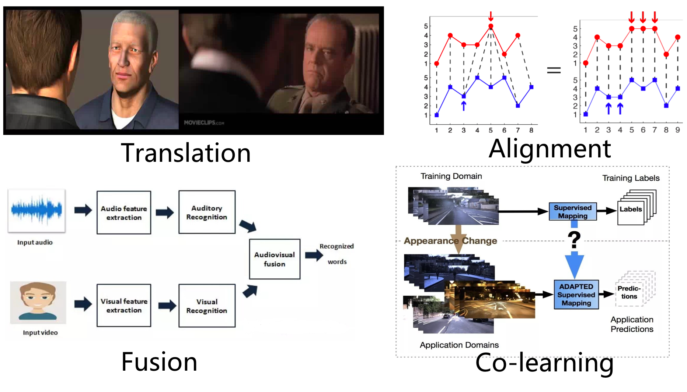

# 多模态

### Praface
模态（Modality）：每一种信息的来源或者形式，都可以称为一种模态。例如，人有触觉，听觉，视觉，嗅觉；信息的媒介，有语音、视频、文字等；

**多模态任务中的四大挑战：**
* 转化 (Translation) / 映射 (Mapping)：转化也称为映射，负责将一个模态的信息转换为另一个模态的信息
* 对齐 (Alignment)：多模态的对齐负责对来自同一个实例的不同模态信息的子分支/元素寻找对应关系
* 融合 (Multimodal Fusion)：多模态融合（Multimodal Fusion ）负责联合多个模态的信息，进行目标预测（分类或者回归） 
* 协同学习 （Co-learning）：协同学习是指使用一个资源丰富的模态信息来辅助另一个资源相对贫瘠的模态进行学习

### Paper
- **基于玻尔兹曼机的多模学习**
  [Multimodal learning with deep boltzman machine](https://www.cs.cmu.edu/~rsalakhu/papers/Multimodal_DBM.pdf) 

  论文中的实验通过 Bimodal DBM，学习图片和文本的联合概率分布 P(图片，文本)。在应用阶段，输入图片，利用条件概率 P(文本/图片)，生成文本特征，可以得到图片相应的文本描述；而输入文本，利用条件概率 P(图片/文本)，可以生成图片特征，通过检索出最靠近该特征向量的两个图片实例，可以得到符合文本描述的图片

- **VideoBERT**
   [VideoBERT: A Joint Model for Video and Language Representation Learning ](https://arxiv.org/pdf/1904.01766.pdf)
   
   借鉴了语言建模中十分成功的 BERT 模型，在它的基础上进行改进，从视频数据的向量量化和现有的语音识别输出结果上分别导出视觉 token 和语言学 token，然后在这些 token 的序列上学习双向联合分布。

- **Video Thumbnails**
  [To Click or Not To Click:Automatic Selection of Beautiful Thumbnails from Videos](https://arxiv.org/pdf/1609.01388.pdf)

  基于传统视觉学习方法，快速生成视频缩略封面图 [more](VedioThumbnails_yahoo_click_or_not.md)
