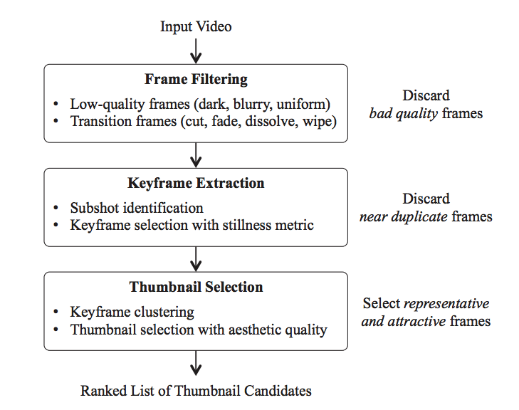

#视频生成缩略图

原文链接：https://arxiv.org/pdf/1609.01388.pdf

论文：To Click or Not To Click: Automatic Selection of Beautiful Thumbnails from Videos
论文链接：[https://arxiv.org/pdf/1609.01388.pdf](https://arxiv.org/pdf/1609.01388.pdf)
代码链接：[https://github.com/yahoo/hecate](https://github.com/yahoo/hecate)

## INTRODUCTION

在搜索、推荐场景中，视频封面作为视频内容的第一眼信息，很大程度上影响着用户的点击意愿，特别是在展示区域有限的情况下，如果没有将视频里的精彩部分展示出来对于流量是一种浪费。

Google在2015年使用基于DNN的GoogleLeNet智能封面生成算法，由于YouTube存在大量静心挑选的视频封面，所以数据集获取相对容易。

针对同一个问题,Yahoo于2016年在CIKM上发表了本篇论文，采用的是传统计算机视觉相关的特征。在帧的采样上，采用过滤+关键帧提取的方式，而不是Youtube所使用的均匀采样。同时，封面的选择基于两个标准：候选帧与视频内容的相关程度以及帧的质量。

整个处理流程分为三个步骤：帧过滤、关键帧提取以及封面图选择。

## 实验结果：
Table1是关于conner pooling的对比实验，可以看出添加conner pooling（第二行）对效果的提升比较明显，这种提升尤其在目标尺度比较大的数据中表现明显。

Table2是关于对不同位置负样本采取不同权重的损失函数的效果。第一行是不采用这种策略的效果；第二行是采用固定半径值的效果，可以看出提升比较明显；第三行是采用基于目标计算得到的半径值的效果（这篇文章所采用的），效果得到进一步提升。

Table3是关于这篇文章的几个创新点效果。第一行是这篇文章的算法结果；第二行是将角点预测结果用ground truth代替，可以看到提升非常大；第三行是进一步将偏置用ground truth代替，相比之下提升会小很多。这说明目前该算法的瓶颈主要在于角点预测。

Table4是connerNet和其他目标检测算法的效果对比，可以看出模型效果还是很不错的。

