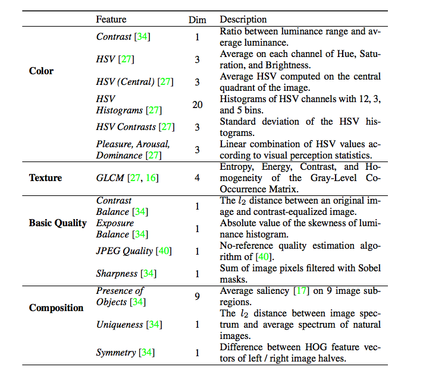

# 视频生成缩略封面图

## Preface

论文：To Click or Not To Click: Automatic Selection of Beautiful Thumbnails from Videos

论文链接：[https://arxiv.org/pdf/1609.01388.pdf](https://arxiv.org/pdf/1609.01388.pdf)

代码链接：[https://github.com/yahoo/hecate](https://github.com/yahoo/hecate)

## Introduction

   在搜索、推荐场景中，视频封面作为视频内容的第一眼信息，很大程度上影响着用户的点击意愿，特别是在展示区域有限的情况下，如果没有将视频里的精彩部分展示出来对于流量是一种浪费。

   常见的封面图选择策略：
   * 选择第一帧
   * 关键帧随机选择一张（关键帧策略：等间隔，视觉特征选择，深度网络选择）
   * 关键帧候选多张，用户自己选择

   Google在2015年使用基于DNN的GoogleLeNet智能封面生成算法，由于YouTube存在大量静心挑选的视频封面，所以数据集获取相对容易。

   针对同一个问题,Yahoo于2016年在CIKM上发表了本篇论文，采用的是传统计算机视觉相关的特征。在帧的采样上，采用过滤+关键帧提取的方式，而不是Youtube所使用的均匀采样。同时，封面的选择基于两个标准：候选帧与视频内容的相关程度以及帧的质量。

   整个处理流程分为三个步骤：帧过滤、关键帧提取以及封面图选择。
   

###  帧过滤  
   要过滤的帧包括低质帧与过渡帧。低质的衡量标准包括亮度、清晰度以及色彩单一度，满足一定阈值(经验值)要求方可保留。
   - 低质量帧
     
 
     色彩单一度(uniformity)可以解释成top5%的灰度值占所有像素的比例。做法是对视频帧进行灰度处理，做成统计直方图，排序，选取前5%的像素值，统计这5%所占比例，如果占比高于某一个阈值的话，说明这张图单色度高
   - 过渡帧
  
     论文中过渡帧的识别可以转化为分镜头检测（shot boundary detection），检测初镜头切换之间的无效过渡帧。文中通过检测相邻帧间的边缘变化速率来识别边界，并丢弃边界附近的过渡帧。
     

   这两个过滤步骤均是基于简单的像素值计算，因此非常快速。处理时长约点视频总时长的0.3%（具体因机器性能而异）。

### 关键帧提取
   
   作者同样采用的聚类的方式，先聚出k个shots，然后再对每个shot做聚类，聚出k个subshots。

   聚类的特征使用的是帧的HSV直方图(128 bins * 3通道) + 水平和垂直方向的梯度直方图( 30 bins * 2方向), 取双层(2x2)空间金字塔。所以，总的向量维度是( 128 * 3 + 30 * 2 ) * ( 1 + 4) = 2220

   对于每个cluster，作者并没有直接取聚类中心，而是选择了stillness最大的帧作为关键帧，也就是选择了最静止态的关键帧。

   这个stillness数学上计算方法：按时间序列计算两帧之间差值的均方值，然后取倒数得到
   

   *这个步骤的处理时长约占整体视频时长的0.27%。*

### 封面选择
   在经过前面两步之后，计算量已经大幅降低。下一步则是如何rank候选的关键帧。

   如前所述，从这两个维度综合考虑：
   - 帧与视频内容的相关程度
   - 帧本身的质量

   #### 帧与视频内容的相关程度
   怎么来衡量帧与视频内容相关程度呢？作者的做法还是聚类，通过间隔统计的方式寻找最优的簇个数。论文中作业设置簇个数为5——10，寻找一个最合适的簇数目。聚类后，某一簇成员数越大，则该簇中的帧与视频整体的相关性越大。按照簇成员个数数目排序，在每一个簇中选一帧，那么怎么从簇中选择出一帧呢？作者设置了一个美学分数（aesthetics）概念，计算出每一帧的Frame Attractiveness的得分。
   #### 帧本身的质量
   帧本身的质量也取决于此帧是否具有Attractiveness，也是需要计算美学得分

   那么怎么计算这个美学分数呢？

   + 无监督方式：选择stillness最大的一帧的得分
   + 有监督方式：建立随机森林做分类算出得分

   有监督方式对每一关键帧构造了一个52维的向量，包含颜色、纹理、基础质量及构图四个方面。

   颜色方面主要是HSV统计量，如平均HSV, 中央平均HSV, HSV颜色直方图，HSV对比度，以及对比度，Pleasure, Arousel, Dominance.纹理方面则是基于Haralick特征, 包括Entropy, Energy,   Homogeneity, GLCM。构图方面，则是三分法则、对称构图及原创性(Uniqueness， 这个有点虚)
   

   基础质量方面考察了四个维度，包含对比度平衡、曝光平衡、JPEG质量以及全局清晰度。

   作者使用Random Forest在AVA aesthetic database（美学数据集，人工定义图片是看起来比较舒畅，好的图，总共250，000张图）数据集上做训练，通过五折交叉验证，得到最优的树的棵数为100，MSE为0.36，皮氏相关系数为0.49.

## 实验结果：

结果显示无监督方式效果最好。作者在文章中重点讲的是有监督的算法，而这个算法使用了大量不同维度的视觉特征，直观上应该是性能最好才对。猜测原因可能是数据集质量问题，导致美学分数偏差较大

这篇文章的实现方法略显繁琐，手工特征工程非常费劲。不过，因为没有使用特别费时的算法(如DNN)，甚至可以只有无监督的方式下工作，处理的速度是其一大优势，非常适用作为一个baseline方法快速上线。

### Reference
- [视频提取关键帧提取-csdn](https://blog.csdn.net/Ailberty/article/details/109581016?utm_medium=distribute.pc_relevant_download.none-task-blog-baidujs-1.nonecase&depth_1-utm_source=distribute.pc_relevant_download.none-task-blog-baidujs-1.nonecase)
- [如何让机器来给视频选择封面？-知乎](https://zhuanlan.zhihu.com/p/38440310)
- [多模态视频分析技术研究与应用](https://www.mdeditor.tw/pl/2FPy)
- [视频中的关键帧提取-知乎](https://zhuanlan.zhihu.com/p/38289781)
- [Improving YouTube video thumbnails with deep neural nets(GoogleAIBlog)](https://ai.googleblog.com/2015/10/improving-youtube-video-thumbnails-with.html)
