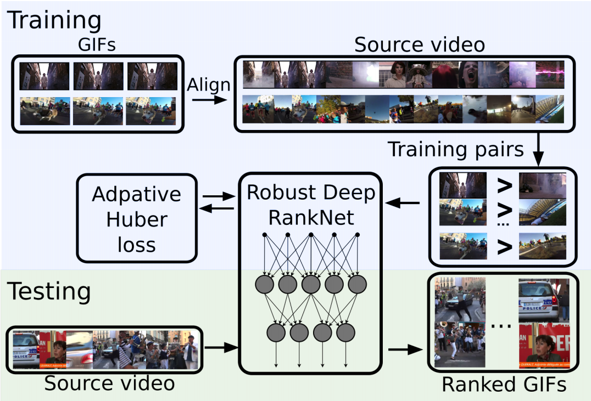
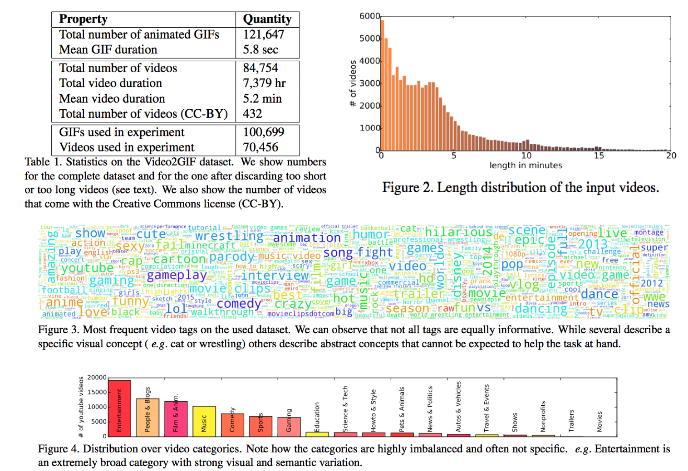
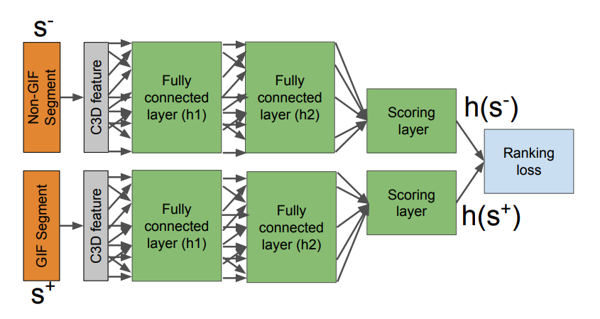
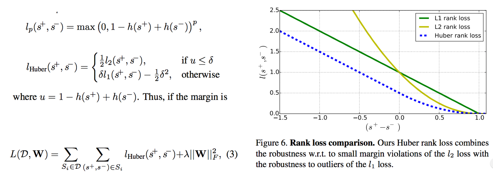
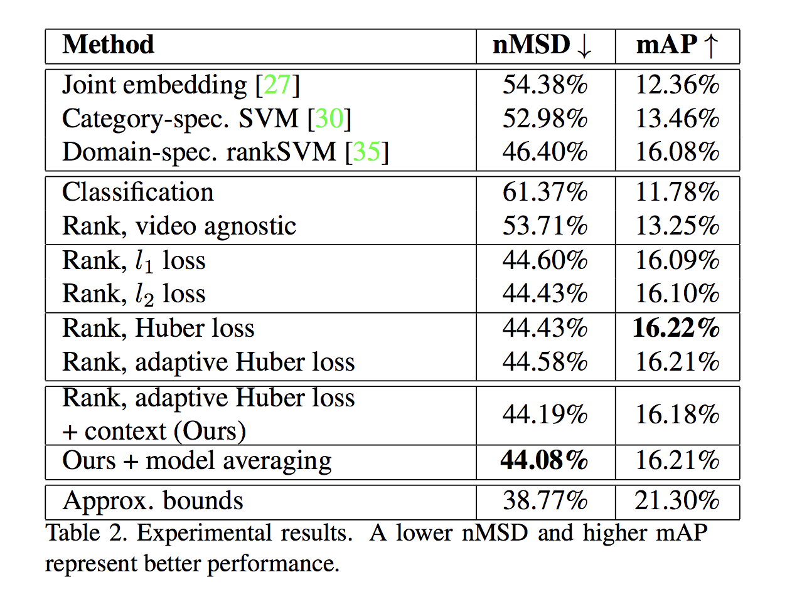

# Video2GIF 视频生成Gif图

## Preface
论文：[Video2GIF: Automatic Generation of Animated GIFs from Video](https://arxiv.org/pdf/1605.04850.pdf)

code: [https://github.com/gyglim/video2gif_code](https://github.com/gyglim/video2gif_code)

dataset: [https://github.com/gyglim/video2gif_dataset](https://github.com/gyglim/video2gif_dataset)

author resume：[https://gyglim.github.io/me/](https://gyglim.github.io/me/)

## Introduction
  1. 匹配Gif图与源youtube视频，形成一个数据集
  2. 采用training pairs训练RankNet网络
  3. 引入自适应的HuberLoss计算pair之间的误差
  4. 测试输入视频，输出视频中的小片段成为GIF的匹配度

  
### Video2Gif数据集
  作者在Gif生成软件库里收集了包含120K个动图，以及超过80K个的视频，总体包括了7379小时的数据。为了数据库能够从各个方面进行进一步的评估应用等，这里要找到GIF与其对应的源视频，打算做一个将二者匹配起来的工作，也方便之后监督学习的时候作为训练数据。
  
  GIF与源视频进行匹配的工作，采用的是将两者的每一帧都采用离散余弦变化得到的一个矢量表示，之后这个矢量用感知hash二值化表现形式进行体现，最后通过比较这个矩阵的汉明距离来判断是否出现了重复片段，以此判断动图的归属。假设GIF的帧数为K，视频集中所有帧为N，那么这么做的时间复杂度是O(NK)，其实这是很大的一个时间复杂度，但是由于一个GIF一般组成的帧数都比较少，也就是K<50，逐帧对比能够保证很高的准确率，在结果完美的情况下牺牲一下时间复杂度完成这个结果。因为这个方法想要建立的是数据库，那么结果准确度是十分重要的。
  

  上图是视频类别的分布直方图，我们发现娱乐版块的视频是最多的。这个结果也是很符合当前人们的思想方向，一般制作的动图作用在于博取人们的眼球，以搞笑为主。
### 网络训练与检测过程
  首先要生成训练样本pairs，把视频按照边界(shot boundary)检测算法([*Summarizing Web Videos Using Titles. CVPR, 2015*](https://www.cv-foundation.org/openaccess/content_cvpr_2015/papers/Song_TVSum_Summarizing_Web_2015_CVPR_paper.pdf))分割成不重叠的视频片段***S = {s1, ..., sn}***。
  
  其中和Groundtruth重叠达到66%以上的片段标记为正样本，没有任何重叠的片段标记为负样本。训练阶段输入的是 GIF和负例这一对画面，之后提取C3D的图片特征，接着通过两个卷积层，最后通过loss的优化去计算卷积层神经网络的权重值。而在测试的时候输入一个视频片段，经过以及训练好的神经网络，计算可能产生GIF的匹配度。其中绿色的框框内，表示的是卷积层，每个卷积层后面都包含一个非线性激活层函数。
  
  
  
  其中，C3D图片特征是在Sports-1M上训练好的AlexNet的拓展，将原来2D的卷积层变成3D的时空限制的卷积层，是已有模型直接得到的结果。此外，在这个C3D中，本文还加入图片类别影响因素，也就是刚刚统计数据库信息里面的信息。这种语义植入视频标签的方式，就是比较有趣的视频，可能相应的能够从其中提取到有效信息的可能性就会上升。
  
  而在计算loss阶段，需要有的限制就是，h(s^+ )>h(s^- ), ∀(s^+,s^-)∈S，其中h就是网络的输出值，也就是体现当前片段能够成为GIF的匹配度。值得注意的是，训练时候正例和负例来自同一个源视频，不同视频的正例和反例之间的比较由于视频内容的不同是没有意义的。
  
  
  
  由上图可以看出，L1 在模拟正常的范围内（0.0-1.0）的损失的时候，下降太快，用这个来考察是很不合理的，因为在正负例差值越大，越接近1.0的情况下应该是模型拟合的效果越好，loss越慢下降才对。虽然L2在这一点的拟合上表现良好，但是当出现异常情况（<0.0）的时候得到的loss会直接变成很大的值甚至超过范围，因此文章提出了结合两种loss计算方式的自适应的Huber loss。
  
## Result
  模型结果对比结果
  
  
  
  nMSD(normalized MSD(average meaningful summary duration))表示的是一段视频中能挑出多少份有意义的片段。但是经过研究发现，这个数据跟视频本身的长度有很大的关系，因为长度越长的源视频就如同大海捞针，MSD会降低。因此采用了加入时长的影响因素。 nMSD值越小，表明模型效果约好。
  
  文章的贡献在于：
  1、本文提出了一种鲁棒性很强Huber loss的RankNet网络来解决本问题的方法，并且采用了正负例对比处理，对噪声信息的把控较高。
  2、建立了GIF与其对应源视频的数据库，并且还进行了一系列分析。

  当然文章还有可以改进的地方，就是文章只是考虑了单个视频小片段能否成为GIF的可能性，而GIF有可能横跨好几个小镜头，如何结合这些小片段进行联合得到更好的结果，还是有待研究的。
## Reference
1. [Video2Gif-csdn](https://blog.csdn.net/loria_11/article/details/69487764)
2. [Shot边界检测----2001-2007TRECVID比赛算法总结-csdn](https://blog.csdn.net/u010821666/article/details/77993150)
3. [C3D network: 用于视频特征提取的3维卷积网络](https://zhuanlan.zhihu.com/p/25912625)
4. [C3D User Guide](https://docs.google.com/document/d/1-QqZ3JHd76JfimY4QKqOojcEaf5g3JS0lNh-FHTxLag/edit)
5. [C3D: Generic Features for Video Analysis](https://research.fb.com/blog/2014/12/c3d-generic-features-for-video-analysis/) 

